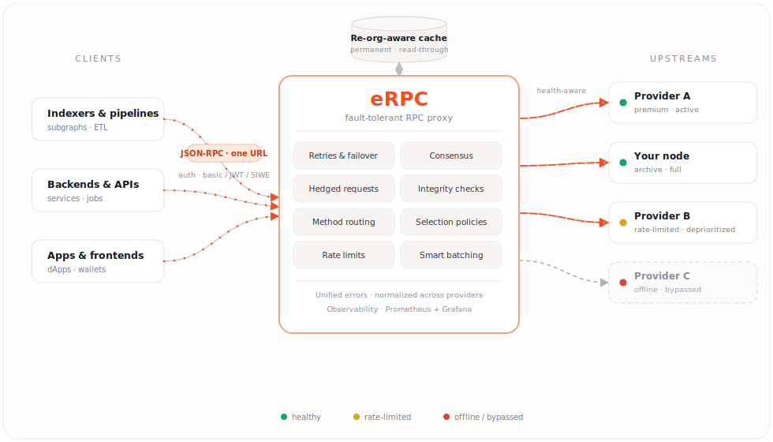

<p align="center">
  
</p>

[](https://github.com/erpc/erpc/actions/workflows/release.yml)
[](https://docs.erpc.cloud/)
[](https://github.com/erpc/erpc/blob/main/LICENSE)
[](https://github.com/erpc/erpc/graphs/contributors)
[](https://t.me/erpc_cloud)

eRPC is a fault-tolerant EVM RPC proxy with **re-org-aware permanent caching**. It sits in front of all your upstreams — managed providers and your own nodes — behind a single endpoint, and handles failover, retries, caching, and multi-chain routing automatically. Built for read-heavy workloads such as data indexing and high-load frontends.



---

### Quick Start

With the below setup, you get immediate access to 2,000+ chains and 4,000+ public free EVM RPC endpoints.

#### Run an eRPC instance:

Using `npx`:

```bash
npx start-erpc
```

Or, using `Docker`:

```bash
docker run -p 4000:4000 ghcr.io/erpc/erpc
```

Or, using `Railway`:

[](https://railway.com/template/10iW1q?referralCode=PpPFJd)

#### Send a request to your eRPC instance:

```bash
curl 'http://localhost:4000/main/evm/42161' \
--header 'Content-Type: application/json' \
--data '{
    "method": "eth_getBlockByNumber",
    "params": ["latest", false],
    "id": 9199,
    "jsonrpc": "2.0"
}'
```

#### Send a request against a Solana cluster (SVM):

```bash
curl 'http://localhost:4000/main/svm/mainnet-beta' \
--header 'Content-Type: application/json' \
--data '{
    "method": "getSlot",
    "params": [{"commitment":"confirmed"}],
    "id": 1,
    "jsonrpc": "2.0"
}'
```

SVM networks identify themselves as `svm:<cluster>` (e.g. `svm:mainnet-beta`, `svm:devnet`, `svm:testnet`). The same failsafe, cache, and hedging machinery EVM uses applies to SVM — commitment-aware finality, `sendTransaction` retry guards, and a per-upstream slot poller are wired automatically. See `erpc.svm.example.yaml` for a full configuration.

#### Next Steps:
This setup is ideal for development and testing purposes. For production environments, we recommend extending your configuration with dedicated premium providers and advanced failover settings. See our [Configuration Guide](https://docs.erpc.cloud/config/example) for more details.

---

### Key Features

- **Retries, failover, circuit breakers & hedged requests**: every call is routed to the fastest healthy upstream, automatically.
- **Re-org-aware permanent cache**: serve reads from [cache](https://docs.erpc.cloud/operation/cache), stay consistent across chain reorgs, and eliminate redundant upstream calls.
- **Automatic method routing**: no need to track which provider supports which `eth_*` method.
- **Configurable rate limits**: set hourly or daily [rate limits](https://docs.erpc.cloud/config/rate-limiters) and compute-unit budgets per upstream to control usage and cost.
- **Selection policies**: [influence which upstreams serve traffic](https://docs.erpc.cloud/config/projects/selection-policies) — e.g. cheap-first until error-rate or block-lag thresholds are crossed.
- **Consensus & data integrity**: [compare results across upstreams](https://docs.erpc.cloud/config/failsafe/integrity), enforce consensus, and penalize nodes that disagree or return stale data.
- **Unified error handling**: consistent, normalized error codes and messages across every provider.
- **Flexible authentication**: [basic auth, secrets, JWT, SIWE](https://docs.erpc.cloud/config/auth) and more.
- **Smart batching**: [aggregate multiple RPC or contract calls into one](https://docs.erpc.cloud/operation/batch).
- **Observability**: track throughput (RPS), errors, and latency per upstream from a single Grafana dashboard.

---

### Case Studies

- 🔵 [Moonwell: How eRPC slashed RPC calls by 67%](https://erpc.cloud/case-studies/moonwell)  
- 🟢 [Chronicle: How eRPC reduced RPC cost by 45%](https://erpc.cloud/case-studies/chronicle)

---

### CLI Commands

eRPC provides several CLI commands beyond the default server start:

#### `erpc validate <config-file>`

Validate a configuration file (TS, JS, or YAML) and report any errors, warnings, or notices. Useful in CI pipelines to catch misconfigurations before deployment.

```bash
erpc validate erpc.yaml
erpc validate erpc.ts
```

#### `erpc dump <config-file>`

Parse a configuration file and output the fully resolved configuration with all eRPC defaults applied. Supports YAML and JSON output. This is useful for inspecting what your final config looks like after eRPC fills in all default values (retry policies, timeouts, selection policies, etc.).

```bash
# Output as YAML (default)
erpc dump erpc.yaml

# Output as JSON
erpc dump --format json erpc.ts

# Compare two configs (e.g. before/after a migration)
diff <(erpc dump old-config.yaml) <(erpc dump new-config.yaml)
```

---

### Local Development

1. **Clone this repository:**

```bash
git clone https://github.com/erpc/erpc.git
```

2. **Install Go dependencies:**

```bash
make setup
```

3. **Create a configuration file:**

```bash
cp erpc.dist.yaml erpc.yaml
vi erpc.yaml
```

4. **Run the eRPC server:**

```bash
make run
```

---

### Contributors

<a href="https://github.com/erpc/erpc/graphs/contributors">
  
</a>

<p>
  By contributing to this project, you agree that your contributions may be used in both the open-source and enterprise versions of the software. Please review our 
  <a href="./CONTRIBUTING.md">Contributing Guidelines</a> and 
  <a href="./CLA.md">Contributor License Agreement</a> before submitting your contributions.
</p>

---

### License

Apache 2.0 
