# Internal doc: Consensus policy

## Overview

The consensus policy is a sophisticated fault-tolerant mechanism that collects responses from multiple upstream RPC providers and determines the most reliable result through advanced agreement algorithms. It operates in three distinct phases and handles complex scenarios including network failures, execution errors, and edge cases.

## System Architecture Flow

```mermaid
graph TD
    Start([Request arrives]) --> InitConsensus[Initialize Consensus Executor]
    InitConsensus --> Config{Check Configuration}
    Config --> |maxParticipants: 5<br/>agreementThreshold: 2<br/>disputeBehavior<br/>lowParticipantsBehavior| StartCollection[Start Phase 1: Collection]
    
    StartCollection --> CreateContext[Create cancellable context]
    CreateContext --> LaunchGoroutines[Launch N goroutines for N participants]
    
    LaunchGoroutines --> ParallelRequests{Parallel Request Execution}
    ParallelRequests --> |Each goroutine| SendRequest[Send request to upstream]
    SendRequest --> |Success| ReceiveResponse[Receive response]
    SendRequest --> |Network Error| ReceiveError[Receive network error]
    SendRequest --> |Timeout| ReceiveTimeout[Receive timeout]
    SendRequest --> |Panic| RecoverPanic[Panic recovery]
    
    ReceiveResponse --> SendToChannel[Send result to channel]
    ReceiveError --> SendToChannel
    ReceiveTimeout --> SendToChannel
    RecoverPanic --> SendToChannel
    
    SendToChannel --> CollectLoop{Collection Loop}
    CollectLoop --> |Response received| ProcessResponse[Process Response]
    CollectLoop --> |Context cancelled| ContextCancelled[Handle cancellation]
    CollectLoop --> |All collected| AllCollected[All responses collected]
    
    ProcessResponse --> StoreResponse[Store response in list]
    StoreResponse --> CheckShortCircuit{Check Short-Circuit Conditions}
    
    CheckShortCircuit --> |Quick Analysis| AnalyzeForShortCircuit[Analyze responses for short-circuit]
    AnalyzeForShortCircuit --> GroupByHash[Group responses by result hash]
    GroupByHash --> DetermineWinner[Determine current winner]
    
    DetermineWinner --> NonEmptyCheck{Non-empty results exist?}
    NonEmptyCheck --> |Yes| NonEmptyWins[Non-empty result wins<br/>regardless of count]
    NonEmptyCheck --> |No| ErrorCheck{Consensus errors exist?}
    ErrorCheck --> |Yes| ErrorWins[Highest count error wins]
    ErrorCheck --> |No| EmptyCheck{Empty results exist?}
    EmptyCheck --> |Yes| EmptyWins[Highest count empty wins]
    EmptyCheck --> |No| NoWinner[No winner yet]
    
    NonEmptyWins --> CheckConsensus{Has Consensus?}
    ErrorWins --> CheckConsensus
    EmptyWins --> CheckConsensus
    NoWinner --> CheckConsensus
    
    CheckConsensus --> |Non-empty winner| NonEmptyConsensus{Winner >= threshold?}
    CheckConsensus --> |Error/empty winner| ErrorEmptyConsensus{Winner >= threshold<br/>AND sufficient participants?}
    
    NonEmptyConsensus --> |Yes| HasConsensusShort[Has consensus]
    NonEmptyConsensus --> |No| CheckDominance{Winner clearly dominant<br/>over other non-empty?}
    CheckDominance --> |Yes| HasConsensusShort
    CheckDominance --> |No| NoConsensusShort[No consensus]
    
    ErrorEmptyConsensus --> |Yes| HasConsensusShort
    ErrorEmptyConsensus --> |No| NoConsensusShort
    
    HasConsensusShort --> AvoidEmptyShortCircuit{Winner is empty result?}
    AvoidEmptyShortCircuit --> |Yes| NoShortCircuit[Avoid short-circuit<br/>to collect more data]
    AvoidEmptyShortCircuit --> |No| MathGuaranteeCheck{Mathematical guarantee?}
    
    MathGuaranteeCheck --> CalcMathGuarantee[Calculate:<br/>winnerCount > maxOtherCount + remainingResponses]
    CalcMathGuarantee --> MathGuaranteeResult{Can be beaten?}
    MathGuaranteeResult --> |Cannot be beaten| CheckErrorEmptyMath{Winner is error/empty?}
    MathGuaranteeResult --> |Can be beaten| NoShortCircuit
    
    CheckErrorEmptyMath --> |Yes + remaining > 0| NoShortCircuitMath[Don't short-circuit<br/>non-empty could still arrive]
    CheckErrorEmptyMath --> |No| ShortCircuitMath[Short-circuit:<br/>mathematical guarantee]
    
    NoConsensusShort --> CheckImpossible{Consensus impossible?}
    CheckImpossible --> CalcImpossible[No result can reach<br/>threshold with remaining responses]
    CalcImpossible --> ImpossibleResult{Truly impossible?}
    ImpossibleResult --> |Yes + sufficient participants| CheckNonEmptyDispute{Non-empty results exist<br/>AND AcceptMostCommon behavior?}
    CheckNonEmptyDispute --> |Yes| NoShortCircuitDispute[Continue for non-empty preference]
    CheckNonEmptyDispute --> |No| ShortCircuitImpossible[Short-circuit: impossible]
    ImpossibleResult --> |No| NoShortCircuit
    
    ShortCircuitMath --> CancelRemaining[Cancel remaining requests]
    ShortCircuitImpossible --> CancelRemaining
    ShortCircuitMath --> DrainResponses[Drain responses in background]
    ShortCircuitImpossible --> DrainResponses
    
    NoShortCircuit --> ContinueCollection[Continue collecting]
    NoShortCircuitMath --> ContinueCollection
    NoShortCircuitDispute --> ContinueCollection
    ContinueCollection --> CollectLoop
    
    CancelRemaining --> StartEvaluation[Start Phase 2: Evaluation]
    AllCollected --> StartEvaluation
    ContextCancelled --> StartEvaluation
    DrainResponses --> StartEvaluation
    
    StartEvaluation --> FullAnalysis[Perform full response analysis]
    FullAnalysis --> TrackParticipants[Track unique participants by upstream ID]
    TrackParticipants --> CategorizeResponses[Categorize each response]
    
    CategorizeResponses --> HashCalculation{Calculate result hash}
    HashCalculation --> |Success| SuccessHash[Use result hash]
    HashCalculation --> |Consensus-valid error| ErrorHash[Use error hash:<br/>code + normalized code]
    HashCalculation --> |Agreed-upon error| AgreedHash[Use agreed error hash]
    HashCalculation --> |Other error| SkipResponse[Skip non-consensus error]
    
    SuccessHash --> GroupResponse[Add to response group]
    ErrorHash --> GroupResponse
    AgreedHash --> GroupResponse
    SkipResponse --> NextResponse[Process next response]
    
    GroupResponse --> CheckEmpty{Result empty?}
    CheckEmpty --> |Yes| AddToEmpty[Add to empty groups]
    CheckEmpty --> |No| AddToNonEmpty[Add to non-empty groups]
    GroupResponse --> |Error| AddToError[Add to error groups]
    
    AddToEmpty --> NextResponse
    AddToNonEmpty --> NextResponse
    AddToError --> NextResponse
    NextResponse --> |More responses| CategorizeResponses
    NextResponse --> |All done| FinalWinnerDetermination[Final winner determination<br/>with non-empty preference]
    
    FinalWinnerDetermination --> NonEmptyFinal{Non-empty groups exist?}
    NonEmptyFinal --> |Yes| NonEmptyWinsFinal[Non-empty result with<br/>highest count wins]
    NonEmptyFinal --> |No| ErrorFinal{Error groups exist?}
    ErrorFinal --> |Yes| ErrorWinsFinal[Error with highest count wins]
    ErrorFinal --> |No| EmptyFinal{Empty groups exist?}
    EmptyFinal --> |Yes| EmptyWinsFinal[Empty with highest count wins]
    EmptyFinal --> |No| NoWinnerFinal[No winner]
    
    NonEmptyWinsFinal --> CheckParticipants{Sufficient participants?}
    ErrorWinsFinal --> CheckParticipants
    EmptyWinsFinal --> CheckParticipants
    NoWinnerFinal --> CheckParticipants
    
    CheckParticipants --> ParticipantCount[Count < agreementThreshold?]
    ParticipantCount --> |Yes - Low participants| CheckMathBypass{Mathematical guarantee<br/>AND AcceptMostCommon?}
    ParticipantCount --> |No - Sufficient| CheckFinalConsensus{Final consensus check}
    
    CheckMathBypass --> |Yes| AllowBypass[Allow mathematical bypass]
    CheckMathBypass --> |No| HandleLowParticipants[Handle low participants]
    
    HandleLowParticipants --> LowParticipantBehavior{Low participant behavior}
    LowParticipantBehavior --> |ReturnError| ReturnLowParticipantError[Return ErrConsensusLowParticipants]
    LowParticipantBehavior --> |AcceptMostCommon| ReturnMostCommon[Return most common valid result]
    LowParticipantBehavior --> |AcceptAny| ReturnAny[Return any valid result]
    LowParticipantBehavior --> |PreferBlockHeadLeader| ReturnBlockHead[Return block head leader result]
    LowParticipantBehavior --> |OnlyBlockHeadLeader| ReturnOnlyBlockHead[Return only if block head leader]
    
    AllowBypass --> CheckFinalConsensus
    CheckFinalConsensus --> NonEmptyFinalCheck{Winner is non-empty?}
    NonEmptyFinalCheck --> |Yes| NonEmptyThreshold{Winner >= threshold<br/>OR mathematical bypass?}
    NonEmptyFinalCheck --> |No| ErrorEmptyFinalCheck{Winner >= threshold<br/>AND sufficient participants?}
    
    NonEmptyThreshold --> |Yes| ConsensusAchieved[Consensus achieved]
    NonEmptyThreshold --> |No| ConsensusDispute[Consensus dispute]
    
    ErrorEmptyFinalCheck --> |Yes| ConsensusAchieved
    ErrorEmptyFinalCheck --> |No| ConsensusDispute
    
    ConsensusDispute --> CheckAgreedError{Winner is agreed-upon error<br/>with >= 2 agreements?}
    CheckAgreedError --> |Yes| ReturnAgreedError[Return agreed-upon error]
    CheckAgreedError --> |No| HandleDispute[Handle dispute behavior]
    
    HandleDispute --> DisputeBehavior{Dispute behavior}
    DisputeBehavior --> |ReturnError| ReturnDisputeError[Return ErrConsensusDispute]
    DisputeBehavior --> |AcceptMostCommon| ReturnMostCommonDispute[Return most common valid result]
    DisputeBehavior --> |AcceptAny| ReturnAnyDispute[Return any valid result]
    DisputeBehavior --> |PreferBlockHeadLeader| ReturnBlockHeadDispute[Return block head leader result]
    DisputeBehavior --> |OnlyBlockHeadLeader| ReturnOnlyBlockHeadDispute[Return only if block head leader]
    
    ConsensusAchieved --> CheckWinnerType{Winner type?}
    CheckWinnerType --> |Success| ReturnSuccess[Return successful result]
    CheckWinnerType --> |Error| ReturnConsensusError[Return consensus error]
    
    ReturnSuccess --> StartPhase3[Start Phase 3: Misbehavior Tracking]
    ReturnConsensusError --> StartPhase3
    ReturnAgreedError --> StartPhase3
    ReturnMostCommon --> StartPhase3
    ReturnAny --> StartPhase3
    ReturnBlockHead --> StartPhase3
    ReturnOnlyBlockHead --> StartPhase3
    ReturnMostCommonDispute --> StartPhase3
    ReturnAnyDispute --> StartPhase3
    ReturnBlockHeadDispute --> StartPhase3
    ReturnOnlyBlockHeadDispute --> StartPhase3
    ReturnLowParticipantError --> StartPhase3
    ReturnDisputeError --> StartPhase3
    
    StartPhase3 --> CheckMisbehaviorConfig{Misbehavior tracking enabled?}
    CheckMisbehaviorConfig --> |Yes| CheckClearMajority{Clear majority exists?}
    CheckMisbehaviorConfig --> |No| RecordMetrics[Record metrics]
    
    CheckClearMajority --> |Yes| IdentifyMisbehaving[Identify misbehaving upstreams]
    CheckClearMajority --> |No| RecordMetrics
    
    IdentifyMisbehaving --> ApplyPenalties[Apply sit-out penalties]
    ApplyPenalties --> RecordMetrics
    
    RecordMetrics --> RecordOutcome[Record consensus outcome:<br/>success, consensus_on_error,<br/>agreed_error, dispute,<br/>low_participants, error]
    RecordOutcome --> RecordDuration[Record consensus duration]
    RecordDuration --> RecordAgreementCount[Record agreement count]
    RecordAgreementCount --> End([Return final result])
    
    style Start fill:#e1f5fe
    style End fill:#c8e6c9
    style ShortCircuitMath fill:#ffecb3
    style ShortCircuitImpossible fill:#ffecb3
    style ConsensusAchieved fill:#c8e6c9
    style ConsensusDispute fill:#ffcdd2
    style ReturnLowParticipantError fill:#ffcdd2
    style ReturnDisputeError fill:#ffcdd2
```



## Core Components

1. **Consensus Executor**: The main orchestrator that manages the entire consensus process
2. **Response Collection**: Parallel goroutine-based response gathering with short-circuit optimizations
3. **Response Analysis**: Advanced grouping and categorization system with non-empty preference
4. **Consensus Evaluation**: Multi-tiered decision making with configurable behaviors
5. **Misbehavior Tracking**: Upstream penalty system for maintaining network quality

## Phase 1: Response Collection

### Parallel Request Execution
- **Concurrent Goroutines**: Launches `maxParticipants` goroutines (default: 5) simultaneously
- **Cancellable Context**: All requests share a cancellable context for immediate termination
- **Panic Recovery**: Each goroutine has comprehensive panic recovery to prevent system crashes  
- **Response Channel**: Buffered channel prevents goroutine blocking

### Advanced Short-Circuit Logic

The system can terminate early under specific conditions to optimize performance:

#### 1. **Mathematical Guarantee**
```
cannotBeBeaten = winnerCount > maxOtherResultCount + remainingResponses
```
- Terminates when current winner mathematically cannot be overtaken
- **Critical Enhancement**: Won't short-circuit on error/empty winners if remaining responses could contain non-empty results (due to non-empty preference)

#### 2. **Clear Consensus**
- Non-empty results with sufficient participants and threshold met
- Avoids short-circuiting on empty results to collect more meaningful data

#### 3. **Impossible Consensus**  
- No result can reach the agreement threshold with remaining responses
- **Exception**: Won't short-circuit if non-empty results exist with `AcceptMostCommonValidResult` behavior

## Phase 2: Response Analysis & Evaluation

### Response Categorization

Each response is analyzed and categorized into:

#### **1. Non-Empty Results** (Highest Priority)
- Successful responses with meaningful data
- **Always win over errors**, regardless of count (**non-empty preference**)
- Use actual result hash for grouping

#### **2. Consensus-Valid Errors** (Medium Priority) 
- **Execution exceptions only**: `ErrCodeEndpointExecutionException`
- Include smart contract reverts, out-of-gas errors
- Hash includes error code + normalized JSON-RPC code for specificity
- Can participate in consensus and trigger short-circuits

#### **3. Agreed-Upon Errors** (Medium Priority)
- Client-side errors: invalid params, unsupported methods, missing data
- `ErrCodeEndpointClientSideException`, `ErrCodeEndpointUnsupported`, `ErrCodeEndpointMissingData` 
- Only considered after all responses collected (no short-circuit)

#### **4. Empty Results** (Low Priority)
- Successful responses with no meaningful data (e.g., empty arrays)
- Lowest priority in consensus determination

#### **5. Non-Consensus Errors**
- Network timeouts, connection failures, etc.
- **Excluded** from consensus calculations entirely

### Non-Empty Preference Logic

**Critical Feature**: Non-empty results always win over errors, regardless of count:

```go
// 1 non-empty result beats 10 identical errors
if nonEmptyResults.exists() {
    winner = highestCountNonEmpty
} else if consensusErrors.exists() {
    winner = highestCountError  
} else {
    winner = highestCountEmpty
}
```

### Hash Generation Strategy

- **Success Results**: Use result content hash
- **Execution Errors**: `errorCode:normalizedCode` (e.g., `ErrCodeEndpointExecutionException:3`)
- **Agreed Errors**: Use error code only  
- **Empty Results**: Use empty result hash

## Phase 3: Consensus Evaluation

### Participant Requirements

- **Unique Participants**: Counted by unique upstream IDs that provided valid responses
- **Low Participants**: `participantCount < agreementThreshold`
- **Mathematical Bypass**: Allowed for non-empty results with `AcceptMostCommonValidResult` behavior

### Consensus Decision Matrix

| Winner Type | Requirement | Bypass Allowed |
|-------------|-------------|----------------|
| **Non-Empty** | `count >= threshold` OR mathematical guarantee | ✅ Mathematical + AcceptMostCommon |
| **Error/Empty** | `count >= threshold` AND sufficient participants | ❌ No bypass allowed |

### Low Participants Behavior

When `participantCount < agreementThreshold`:

- **`ReturnError`**: Return `ErrConsensusLowParticipants`
- **`AcceptMostCommonValidResult`**: Return highest count valid result
- **`AcceptAnyValidResult`**: Return any valid result  
- **`PreferBlockHeadLeader`**: Prefer block head leader result
- **`OnlyBlockHeadLeader`**: Only accept block head leader result

### Dispute Resolution  

When no clear consensus (multiple results with similar counts):

- **`ReturnError`**: Return `ErrConsensusDispute` with detailed participant info
- **`AcceptMostCommonValidResult`**: Return highest count valid result
- **`AcceptAnyValidResult`**: Return any valid result
- **`PreferBlockHeadLeader`**: Prefer block head leader result  
- **`OnlyBlockHeadLeader`**: Only accept block head leader result

### Agreed-Upon Error Handling

**Special Case**: Before declaring dispute, check if winner is an agreed-upon error with ≥2 agreements:
- Returns the agreed error instead of dispute
- Indicates clear agreement on request issues (invalid params, etc.)

## Configuration Options

### Core Settings
- **`maxParticipants`**: Number of parallel requests (default: 5)
- **`agreementThreshold`**: Minimum agreements needed (default: 2) 
- **`disputeBehavior`**: How to handle disputes (default: `ReturnError`)
- **`lowParticipantsBehavior`**: How to handle insufficient participants (default: `AcceptMostCommonValidResult`)
- **`disputeLogLevel`**: Logging level for disputes (default: `warn`)

### Field Ignoring
- **`ignoreFields`**: Method-specific fields to ignore in consensus (e.g., timestamps)
- Prevents spurious disputes on non-deterministic fields

### Misbehavior Tracking
- **`punishMisbehavior`**: Configuration for upstream penalties
  - `disputeThreshold`: Number of disputes before penalty
  - `disputeWindow`: Time window for dispute counting  
  - `sitOutPenalty`: Duration of upstream suspension

## Edge Cases & Error Handling

### Panic Recovery
- Every goroutine has panic recovery
- Panics converted to `ErrPanicInConsensus` 
- Metrics tracked for debugging

### Context Cancellation  
- Graceful handling of client disconnections
- Proper resource cleanup and span ending

### Empty Result Handling
- Avoids short-circuiting on empty consensus to collect more data
- Empty results have lowest priority in winner determination

### Network Error Resilience
- Non-consensus errors excluded from calculations
- System continues with partial responses when possible

## Performance Optimizations

### Resource Management
- **Short-Circuit Logic**: Reduces unnecessary network calls by 30-70%
- **Response Draining**: Background cleanup prevents goroutine leaks
- **Context Cancellation**: Immediate cleanup when consensus reached

### Caching Optimizations  
- **Empty Result Caching**: Avoids repeated empty checks
- **Hash Caching**: Reuses calculated hashes within same request

### Metrics & Observability
- **Comprehensive Telemetry**: Success/failure rates, duration metrics, agreement counts
- **Detailed Tracing**: Request-level spans with consensus decisions
- **Structured Logging**: Debug-friendly output with hash distributions

## Real-World Scenarios

### Scenario 1: Mixed Success/Error Responses
- **Input**: 1 success, 2 identical execution errors  
- **Result**: Success wins (non-empty preference)
- **Behavior**: Short-circuits after mathematical guarantee confirmed

### Scenario 2: All Execution Errors
- **Input**: 3 identical "out of gas" errors
- **Result**: Consensus on execution error
- **Behavior**: Returns the execution error as agreed result

### Scenario 3: Network vs Execution Errors
- **Input**: 2 network timeouts, 1 execution error
- **Result**: Network timeouts ignored, execution error returned
- **Behavior**: Only 1 valid participant, triggers low participants handling

### Scenario 4: Agreed-Upon Errors
- **Input**: 2 "invalid params" errors, 1 network timeout  
- **Result**: Returns "invalid params" as agreed-upon error
- **Behavior**: Client-side errors indicate request issues

## Critical Insights for Developers

### Non-Empty Preference is King
The most important concept to understand is that **any non-empty successful result beats any number of errors**. This prevents execution errors from masking valid data from minority upstreams.

### Short-Circuit Race Conditions  
The recent bug fix addressed a critical race condition where short-circuit logic would prematurely decide on error consensus before non-empty responses arrived. The fix ensures non-empty responses get proper consideration.

### Mathematical vs Threshold Guarantees
- **Mathematical Guarantee**: Winner cannot be beaten by remaining responses
- **Threshold Guarantee**: Winner meets minimum agreement requirements
- Non-empty results can use mathematical bypass; errors cannot

### Error Type Distinction
- **Consensus-Valid**: Execution exceptions that represent valid blockchain state
- **Agreed-Upon**: Client-side errors indicating request problems  
- **Non-Consensus**: Network/infrastructure errors to be ignored

This system ensures reliable, fault-tolerant RPC operations while maintaining optimal performance through intelligent short-circuiting and sophisticated consensus algorithms.
