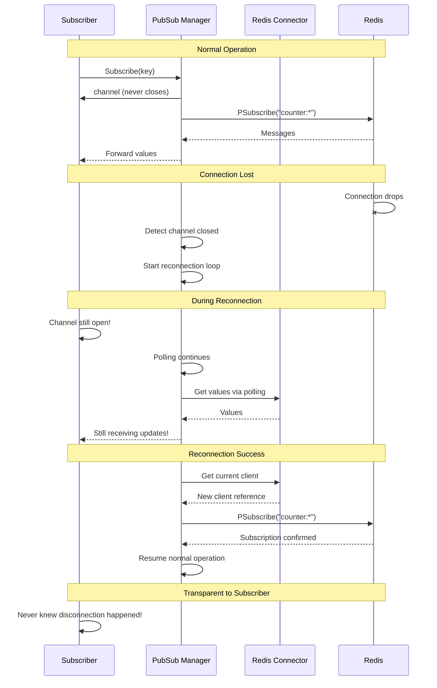

```mermaid
sequenceDiagram
    participant S as Subscriber
    participant PM as PubSub Manager
    participant RC as Redis Connector
    participant R as Redis
    
    Note over S,R: Normal Operation
    S->>PM: Subscribe(key)
    PM->>S: channel (never closes)
    PM->>R: PSubscribe("counter:*")
    R-->>PM: Messages
    PM-->>S: Forward values
    
    Note over S,R: Connection Lost
    R-xR: Connection drops
    PM->>PM: Detect channel closed
    PM->>PM: Start reconnection loop
    
    Note over S,R: During Reconnection
    S->>S: Channel still open!
    PM->>PM: Polling continues
    PM->>RC: Get values via polling
    RC-->>PM: Values
    PM-->>S: Still receiving updates!
    
    Note over S,R: Reconnection Success
    PM->>RC: Get current client
    RC-->>PM: New client reference
    PM->>R: PSubscribe("counter:*")
    R-->>PM: Subscription confirmed
    PM->>PM: Resume normal operation
    
    Note over S,R: Transparent to Subscriber
    S->>S: Never knew disconnection happened!
```