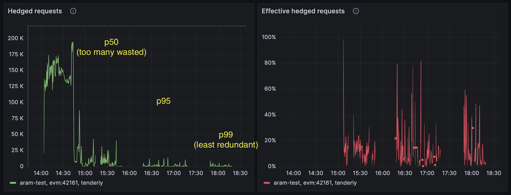

import { Callout, Tabs, Tab } from "nextra/components";

# Failsafe

There are various policies you can use either on [Upstream](/config/projects/upstreams)-level or [Network](/config/projects/networks)-level, to help with intermittent issues and increase general resiliency.

- [`timeout:`](/config/failsafe#timeout-policy) helps prevent requests from hanging indefinitely.
- [`retry:`](/config/failsafe#retry-policy) is used to recover transient issues.
- [`hedge:`](/config/failsafe#hedge-policy) might run simultaneous requests when one upstream is too slow to respond.
- [`circuitBreaker:`](/config/failsafe#circuitbreaker-policy) temporarily removes a down upstream until it recovers.
- [Integrity](/config/failsafe/integrity) module helps increase data quality on certain methods such as getLogs or getBlockByNumber.

Config source code: [common/config.go](https://github.com/erpc/erpc/blob/main/common/config.go#L103-L133)

## `timeout` policy

This policy simply sets a timeout for the request, either on Network-level (when requests are sent to eRPC), or on Upstream-level (when requests are sent to a specific upstream).

<Tabs items={["yaml", "typescript"]} defaultIndex={0} storageKey="GlobalConfigTypeTabIndex">
  <Tabs.Tab>
```yaml filename="erpc.yaml"
# ...
projects:
  - id: main
    networks:
      - architecture: evm
        evm:
          chainId: 42161
        failsafe:
          #...
          timeout:
            # Network-level timeout applies to the whole lifecycle of the request,
            # this includes retries on network and/or upstream level.
            duration: 30s

    upstreams:
      - id: blastapi-chain-42161
        #...
        failsafe:
          timeout:
            # Upstream-level timeout applies each request sent towards the upstream,
            # e.g. if retry policy is set to 2 retries total time will be 30s for:
            duration: 15s
```
</Tabs.Tab>
  <Tabs.Tab>
```ts filename="erpc.ts"
import { createConfig } from "@erpc-cloud/config";

export default createConfig({
  projects: [
    {
      id: "main",
      networks: [
        {
          architecture: "evm",
          evm: {
            chainId: 42161,
          },
          failsafe: {
            //...
            timeout: {
              // Network-level timeout applies to the whole lifecycle of the request,
              // this includes retries on network and/or upstream level.
              duration: "30s",
            },
          },
        },
      ],

      upstreams: [
        {
          id: "blastapi-chain-42161",
          //...
          failsafe: {
            timeout: {
              // Upstream-level timeout applies each request sent towards the upstream,
              // e.g. if retry policy is set to 2 retries total time will be 30s for:
              duration: "15s",
            },
          },
        },
      ],
    },
  ],
});

```
</Tabs.Tab>
</Tabs>

## `retry` policy

This policies will retry certain retryable failures, either on network-level and/or upstream-level.

<Tabs items={["yaml", "typescript"]} defaultIndex={0} storageKey="GlobalConfigTypeTabIndex">
  <Tabs.Tab>
```yaml filename="erpc.yaml"
# ...
projects:
  - id: main
    networks:
      - architecture: evm
        evm:
          chainId: 1
        failsafe:
          # ...
          # On network-level retry policy applies to the incoming request to eRPC,
          # this is additional to the retry policy set on upstream level.
          retry:
            # Total retries besides the initial request:
            maxAttempts: 3
            # Min delay between retries:
            delay: 500ms
            # Maximum delay between retries:
            backoffMaxDelay: 10s
            # Multiplier for each retry for exponential backoff:
            backoffFactor: 0.3
            # Random jitter to avoid thundering herd,
            # e.g. add between 0 to 500ms to each retry delay:
            jitter: 500ms

    upstreams:
      - id: blastapi-chain-42161
        # ...
        failsafe:
          # Upstream-level retry policy applies each request sent towards the upstream,
          # this is additional to the retry policy set on network level.
          # For example if network has 2 retries and upstream has 2 retries,
          # total retries will be 4.
          retry:
            maxAttempts: 2
            delay: 1000ms
            backoffMaxDelay: 10s
            backoffFactor: 0.3
            jitter: 500ms
```
</Tabs.Tab>
  <Tabs.Tab>
```ts filename="erpc.ts"
import { createConfig } from "@erpc-cloud/config";

export default createConfig({
  projects: [
    {
      id: "main",
      networks: [
        {
          architecture: "evm",
          evm: {
            chainId: 1,
          },
          failsafe: {
            // ...
            // On network-level retry policy applies to the incoming request to eRPC,
            // this is additional to the retry policy set on upstream level.
            retry: {
              // Total retries besides the initial request:
              maxAttempts: 3,
              // Min delay between retries:
              delay: "500ms",
              // Maximum delay between retries:
              backoffMaxDelay: "10s",
              // Multiplier for each retry for exponential backoff:
              backoffFactor: 0.3,
              // Random jitter to avoid thundering herd,
              // e.g. add between 0 to 500ms to each retry delay:
              jitter: "500ms",
            },
          },
        },
      ],

      upstreams: [
        {
          id: "blastapi-chain-42161",
          // ...
          failsafe: {
            /*
            * Upstream-level retry policy applies each request sent towards the upstream,
            * this is additional to the retry policy set on network level.
            * For example if network has 2 retries and upstream has 2 retries,
            * total retries will be 4.
            */
            retry: {
              maxAttempts: 2,
              delay: "1000ms",
              backoffMaxDelay: "10s",
              backoffFactor: 0.3,
              jitter: "500ms",
            },
          },
        },
      ],
    },
  ],
});
```
</Tabs.Tab>
</Tabs>

These errors will be retried:

- `5xx` and generally any error that indicate server-side (intermittent) issues.
- `408` which means request timeout.
- `429` which means rate limit exceeded, therefore retrying after few moments.
- `EmptyResponse` for certain methods (e.g. eth_getLogs) if upstream A returns empty array, it could be due to lag in node syncing, so upstream B will be retried.

These errors will not be retried:

- `4xx` and generally any error that indicate client-side issues (invalid request, invalid parameters, etc).
- `UnsupportedMethods` which means upstream does not support certain methods (e.g. eth_traceTransaction)
## `hedge` policy

When a request towards an upstream is slow, the `hedge` policy will start a new simultaneous request towards the next upstream.

<Callout type="info">
  This policy is highly recommended to be set at least on network-level. It will
  ensure if upstream A is slow, a new request towards upstream B will be
  started, whichever responds faster will be returned to the client.
</Callout>

<Tabs items={["yaml", "typescript"]} defaultIndex={0} storageKey="GlobalConfigTypeTabIndex">
  <Tabs.Tab>
```yaml filename="erpc.yaml"
# ...
projects:
  - id: main
    networks:
      - architecture: evm
        evm:
          chainId: 1
        failsafe:
          # ...
          hedge:
            # Recommended: Use quantile-based hedging, e.g. p99:
            quantile: 0.99
            # This fixed-delay is always added to whatever is the quantile-based delay.
            delay: 0ms
            # Minimum delay to wait before trigger next hedge.
            minDelay: 100ms
            # Maximum delay to wait before trigger next hedge.
            maxDelay: 2s
            # Maximum number of hedges to trigger.
            maxCount: 1

            # Alternative: Simple fixed-delay hedging
            # delay: 500ms
            # maxCount: 1
```
</Tabs.Tab>
  <Tabs.Tab>
```ts filename="erpc.ts"
import { createConfig } from "@erpc-cloud/config";

export default createConfig({
  projects: [
    {
      id: "main",
      networks: [
        {
          architecture: "evm",
          evm: {
            chainId: 1,
          },
          failsafe: {
            hedge: {
              // Recommended: Use quantile-based hedging
              quantile: 0.99,
              delay: "0ms",
              minDelay: "100ms",
              maxDelay: "2s",
              maxCount: 1,

              // Alternative: Simple fixed-delay hedging
              // delay: "500ms",
              // maxCount: 1,
            },
          },
        },
      ],
    },
  ],
});
```
</Tabs.Tab>
</Tabs>

The hedge policy supports two modes:

1. **Quantile-based hedging (recommended)**: Uses per-method response time statistics across all upstreams to determine optimal hedge timing. Set `quantile: 0.99` to hedge after the 99th percentile response time plus `delay`. Use `minDelay` and `maxDelay` to bound the hedge timing. Using quantile-based means eRPC will observe the response time of a specific method (across all upstreams) for a while and then decides what should be the hedge delay. This approach means highest effective ness for this feature and lowest wasted number of resources.

2. **Fixed-delay hedging**: Simply waits for `delay` duration before hedging. This approach might be less effective and wasteful by trigger too many hedges that will be discarded anyway.

You can monitor hedging effectiveness through the `erpc_network_hedged_request_total` and `erpc_network_hedge_discards_total` metrics in the sample [Grafana dashboard](/operation/monitoring):



To disable hedge policy, set it to null:

<Tabs items={["yaml", "typescript"]} defaultIndex={0} storageKey="GlobalConfigTypeTabIndex">
  <Tabs.Tab>
```yaml filename="erpc.yaml"
failsafe:
  hedge: ~
```
</Tabs.Tab>
  <Tabs.Tab>
```ts filename="erpc.ts"
failsafe: {
  hedge: null,
}
```
</Tabs.Tab>
</Tabs>

## `circuitBreaker` policy

When upstreams are constantly failing, the `circuitBreaker` policy will temporarily remove them from list of available upstreams.

<Callout type="info">
  This policy is recommended to be set on upstream-level. This will make sure
  temporarily broken upstreams are not used, and will give them time to recover.
</Callout>

<Tabs items={["yaml", "typescript"]} defaultIndex={0} storageKey="GlobalConfigTypeTabIndex">
  <Tabs.Tab>
```yaml filename="erpc.yaml"
# ...
projects:
  - id: main
    upstreams:
      - id: blastapi-chain-42161
        # ...
        failsafe:
          # ...
          circuitBreaker:
            # These two variables indicate how many failures and capacity to tolerate before opening the circuit.
            # e.g. if 80% (160) of last 200 requests have failed, circuit breaker will be opened:
            failureThresholdCount: 160
            failureThresholdCapacity: 200
            # How long to wait before trying to re-enable the upstream after circuit breaker was opened.
            # e.g. after 60s give the upstream another chance:
            halfOpenAfter: 60s
            # These two variables indicate how many successes are required in half-open state before closing the circuit,
            # and putting the upstream back in available upstreams.
            # e.g. after 8 requests have succeeded out of last 10 requests, circuit breaker will be closed:
            successThresholdCount: 8
            successThresholdCapacity: 10
```
</Tabs.Tab>
  <Tabs.Tab>
```ts filename="erpc.ts"
import { createConfig } from "@erpc-cloud/config";

export default createConfig({
  projects: [
    {
      id: "main",
      upstreams: [
        {
          id: "blastapi-chain-42161",
          // ...
          failsafe: {
            // ...
            circuitBreaker: {
              // These two variables indicate how many failures and capacity to tolerate before opening the circuit.
              // e.g. if 80% (160) of last 200 requests have failed, circuit breaker will be opened:
              failureThresholdCount: 160,
              failureThresholdCapacity: 200,
              // How long to wait before trying to re-enable the upstream after circuit breaker was opened.
              // e.g. after 60s give the upstream another chance:
              halfOpenAfter: "60s",
              /*
              * These two variables indicate how many successes are required in half-open state before closing the circuit,
              * and putting the upstream back in available upstreams.
              * e.g. after 8 requests have succeeded out of last 10 requests, circuit breaker will be closed:
              */
              successThresholdCount: 8,
              successThresholdCapacity: 10,
            },
          },
        },
      ],
    },
  ],
});
```
</Tabs.Tab>
</Tabs>

To disable circuit breaker policy, set it to null:

<Tabs items={["yaml", "typescript"]} defaultIndex={0} storageKey="GlobalConfigTypeTabIndex">
  <Tabs.Tab>
```yaml filename="erpc.yaml"
# ...
projects:
  - id: main
    upstreams:
      - id: blastapi-chain-42161
        failsafe:
          circuitBreaker: ~
```
</Tabs.Tab>
  <Tabs.Tab>
```ts filename="erpc.ts"
import { createConfig } from "@erpc-cloud/config";

export default createConfig({
  projects: [
    {
      id: "main",
      upstreams: [
        {
          id: "blastapi-chain-42161",
          failsafe: {
            circuitBreaker: null,
          },
        },
      ],
    },
  ],
});
```
</Tabs.Tab>
</Tabs>

<Callout type="info">
- Circuit breaker "open" means that upstream is temporarily removed from the list of available upstreams.
- Circuit breaker "half-open" means that upstream is tentatively put back into the list of available upstreams,
  but with reduced capacity (e.g. only 10 requests are allowed).
- Circuit breaker "closed" means that upstream is fully recovered and put back into the list of available upstreams.
</Callout>

#### Roadmap

On some doc pages we like to share our ideas for related future implementations, feel free to open a PR if you're up for a challenge:

<br />
- [ ] Allow defining failsafe policies on a per-method basis (e.g. different behavior for eth_getLogs vs other methods).
