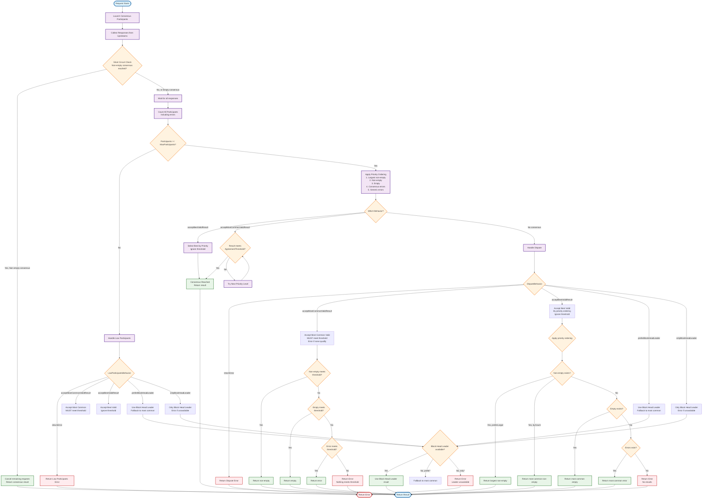

import { Callout, Tabs, Tab } from "nextra/components";

# Consensus

The `consensus` policy sends the same request to multiple upstreams and returns the result only when enough of them agree. This ensures data consistency and detects misbehaving nodes.

<Callout type="warning">
  Consensus can only be configured at **network level** since it requires multiple upstreams to compare results.
</Callout>

## Configuration

<Tabs items={["yaml", "typescript"]} defaultIndex={0} storageKey="GlobalConfigTypeTabIndex">
  <Tabs.Tab>
```yaml filename="erpc.yaml"
projects:
  - id: main
    networks:
      - architecture: evm
        evm:
          chainId: 42161
        failsafe:
          - matchMethod: "*" # Define different consensus thresholds for different methods
            matchFinality: ["finalized", "unknown"] # Read more in Failsafe docs -> Finality states
                          consensus:
                maxParticipants: 4
                agreementThreshold: 2
                disputeBehavior: returnError
                lowParticipantsBehavior: acceptBestValidResult
                preferNonEmpty: true
                preferLargerResponses: true
              punishMisbehavior:
                disputeThreshold: 10
                disputeWindow: 10m
                sitOutPenalty: 30m
```
  </Tabs.Tab>
  <Tabs.Tab>
```ts filename="erpc.ts"
import { createConfig } from "@erpc-cloud/config";

export default createConfig({
  projects: [{
    id: "main",
    networks: [
      {
        architecture: "evm",
        evm: { chainId: 42161 },
        failsafe: [
          {
            matchMethod: "*",      // Can be configured per-method
            consensus: {
              maxParticipants: 3,
              agreementThreshold: 2,
              disputeBehavior: "acceptBestValidResult",
              lowParticipantsBehavior: "acceptMostCommonValidResult",
              preferNonEmpty: true,
              preferLargerResponses: true,
              punishMisbehavior: {
                disputeThreshold: 3,
                disputeWindow: "10s",
                sitOutPenalty: "30s"
              }
            }
          }
        ]
      }
    ]
  }]
});
```
  </Tabs.Tab>
</Tabs>

## Participation options

### `maxParticipants`
Number of upstreams to query in each consensus round. The policy selects the first N healthy upstreams based on their scores.

### `agreementThreshold`
Minimum number of identical responses needed to reach consensus. For example, with `maxParticipants: 3` and `agreementThreshold: 2`, at least 2 upstreams must return the same result.

<Callout type="info">
  **Priority Ordering**: Responses follow a strict priority hierarchy:
  1. **Largest non-empty** (when `preferLargerResponses: true`)
  2. **Non-empty** results
  3. **Empty** results
  4. **Consensus-valid errors** (execution exceptions)
  5. **Generic errors** (network failures, lowest priority)
  
  The behavior (`acceptBestValidResult` vs `acceptMostCommonValidResult`) determines whether the threshold is enforced.
</Callout>

## Behavior options

### `preferNonEmpty`
When enabled (default: `true`), activates the priority ordering system where non-empty responses are prioritized over empty ones, and empty over errors. When disabled, all response types are treated equally based only on count.

### `preferLargerResponses` 
When enabled (default: `true`), among non-empty responses at the same priority level, larger responses (more data) are preferred. This helps ensure you get the most complete data available.

### `disputeBehavior`
When upstreams disagree (no consensus reached), sorted from most loose to strictest:

- **`acceptBestValidResult`**: Returns the best response following priority ordering. **Ignores threshold completely**. Always returns a result if any response is available.
- **`acceptMostCommonValidResult`**: **MUST meet threshold**. Only returns responses that have count ≥ `agreementThreshold`. Follows priority ordering among qualifying results. Returns error if nothing meets threshold.
- **`preferBlockHeadLeader`**: Uses highest block number upstream if available, falls back to `acceptMostCommonValidResult` logic (with threshold).
- **`onlyBlockHeadLeader`**: Only uses highest block upstream, errors if unavailable.
- **`returnError`**: Returns dispute error. Strict agreement required among upstreams.

### `lowParticipantsBehavior`
When fewer than `maxParticipants` respond, sorted from most loose to strictest:

- **`acceptBestValidResult`**: Returns the best available response following priority ordering. **Ignores threshold**. Maximum availability.
- **`acceptMostCommonValidResult`**: **MUST meet threshold**. Only returns responses with count ≥ `agreementThreshold`. Returns error if nothing qualifies.
- **`preferBlockHeadLeader`**: Uses response from block head leader if available, otherwise falls back to `acceptMostCommonValidResult` (with threshold).
- **`onlyBlockHeadLeader`**: Only proceeds if block head leader participated. Errors if leader unavailable.
- **`returnError`**: Fails request. Strict participation requirement.

<Callout type="info">
  **Block Head Leader**: The upstream reporting the highest block number. This is determined by each upstream's state poller and ensures you're getting data from the most synchronized node.
</Callout>

## Priority Ordering System

When `preferNonEmpty` is enabled, responses are evaluated using a strict priority hierarchy:

1. **Largest Non-Empty** (highest priority)
   - When `preferLargerResponses: true`, the non-empty response with the most data wins
   - Example: A response with 100 logs beats one with 10 logs

2. **Non-Empty Results**
   - Any non-empty successful response
   - Selected by count when multiple exist

3. **Empty Results**
   - Valid but empty responses (e.g., `[]` for getLogs)
   - Often indicates no matching data exists

4. **Consensus-Valid Errors**
   - Execution errors that represent valid blockchain state
   - Example: Smart contract reverts, insufficient funds
   - All nodes agree this transaction would fail

5. **Generic/Network Errors** (lowest priority)
   - Transport failures, timeouts, connection errors
   - Only selected if nothing else is available

### How Behaviors Use Priority

- **`acceptBestValidResult`**: Follows priority strictly, ignores threshold. Will return 1 non-empty over 10 errors.
- **`acceptMostCommonValidResult`**: Follows priority but **only among results meeting threshold**. With threshold=3, prefers 3 empty responses over 2 non-empty ones.

## Misbehavior tracking

### `punishMisbehavior`
Temporarily removes upstreams that consistently disagree with the consensus:

- **`disputeThreshold`**: Number of disputes before punishment (e.g., 3 strikes)
- **`disputeWindow`**: Time window for counting disputes (e.g., 10m)
- **`sitOutPenalty`**: How long the upstream is cordoned (e.g., 30m)

## Chain reorganizations
During reorgs, nodes may temporarily disagree on recent blocks. Using `preferBlockHeadLeader` helps resolve disputes by using the response from most up-to-date upstream.

## Performance
Consensus increases costs and latency since it waits for multiple responses. Use it selectively for critical workloads and specific methods rather than all requests.


## Full Flow Diagram


