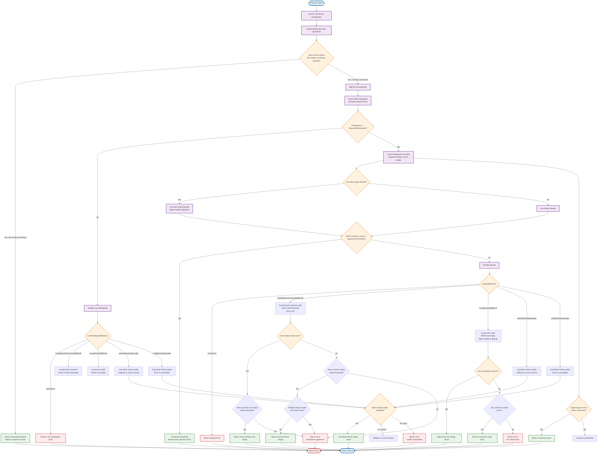

import { Callout, Tabs, Tab } from "nextra/components";

# Consensus

The `consensus` policy sends the same request to multiple upstreams and returns the result only when enough of them agree. This ensures data consistency and detects misbehaving nodes.

<Callout type="warning">
  Consensus can only be configured at **network level** since it requires multiple upstreams to compare results.
</Callout>



## Configuration

<Tabs items={["yaml", "typescript"]} defaultIndex={0} storageKey="GlobalConfigTypeTabIndex">
  <Tabs.Tab>
```yaml filename="erpc.yaml"
projects:
  - id: main
    networks:
      - architecture: evm
        evm:
          chainId: 42161
        failsafe:
          - matchMethod: "*" # Define different consensus thresholds for different methods
            matchFinality: ["finalized", "unknown"] # Read more in Failsafe docs -> Finality states
            consensus:
              requiredParticipants: 4
              agreementThreshold: 2
              disputeBehavior: returnError
              lowParticipantsBehavior: acceptAnyValidResult
              punishMisbehavior:
                disputeThreshold: 10
                disputeWindow: 10m
                sitOutPenalty: 30m
```
  </Tabs.Tab>
  <Tabs.Tab>
```ts filename="erpc.ts"
import { createConfig } from "@erpc-cloud/config";

export default createConfig({
  projects: [{
    id: "main",
    networks: [
      {
        architecture: "evm",
        evm: { chainId: 42161 },
        failsafe: [
          {
            matchMethod: "*",      // Can be configured per-method
            consensus: {
              requiredParticipants: 3,
              agreementThreshold: 2,
              disputeBehavior: "acceptAnyValidResult",
              lowParticipantsBehavior: "acceptMostCommonValidResult",
              punishMisbehavior: {
                disputeThreshold: 3,
                disputeWindow: "10s",
                sitOutPenalty: "30s"
              }
            }
          }
        ]
      }
    ]
  }]
});
```
  </Tabs.Tab>
</Tabs>

## Participation options

### `requiredParticipants`
Number of upstreams to query in each consensus round. The policy selects the first N healthy upstreams based on their scores.

### `agreementThreshold`
Minimum number of identical responses needed to reach consensus. For example, with `requiredParticipants: 3` and `agreementThreshold: 2`, at least 2 upstreams must return the same result.

<Callout type="info">
  Response comparison uses canonical JSON-RPC hashing. **Non-empty responses are always preferred over empty ones**, regardless of count (e.g., 1 non-empty beats 3 empty responses).
</Callout>

## Behavior options

### `disputeBehavior`
When upstreams disagree (no consensus reached):

- **`returnError`**: Returns dispute error. Strict agreement required among upstreams.
- **`acceptMostCommonValidResult`**: Returns most common response if it meets `agreementThreshold`. Prefers non-empty over empty responses. Errors if no clear winner.
- **`acceptAnyValidResult`**: Returns any valid response, preferring non-empty. Lenient fallback.
- **`preferBlockHeadLeader`**: Uses highest block number upstream, falls back to most common.
- **`onlyBlockHeadLeader`**: Only uses highest block upstream, errors otherwise.

### `lowParticipantsBehavior`
When fewer than `agreementThreshold` responses are available:

- **`returnError`**: Fails request. Strict participation requirement.
- **`acceptMostCommonValidResult`**: Uses available upstreams, returns most common if meets threshold. Same non-empty preference and clear winner rules as dispute behavior.
- **`acceptAnyValidResult`**: Uses any available upstream, prefers non-empty. Maximum availability.
- **`preferBlockHeadLeader`**: Uses response from block head leader if available, otherwise use most common response.
- **`onlyBlockHeadLeader`**: Only proceeds if block head leader is agrees with the response.

<Callout type="info">
  **Block Head Leader**: The upstream reporting the highest block number. This is determined by each upstream's state poller and ensures you're getting data from the most synchronized node.
</Callout>

## Misbehavior tracking

### `punishMisbehavior`
Temporarily removes upstreams that consistently disagree with the consensus:

- **`disputeThreshold`**: Number of disputes before punishment (e.g., 3 strikes)
- **`disputeWindow`**: Time window for counting disputes (e.g., 10m)
- **`sitOutPenalty`**: How long the upstream is cordoned (e.g., 30m)

## Chain reorganizations
During reorgs, nodes may temporarily disagree on recent blocks. Using `preferBlockHeadLeader` helps resolve disputes by using the response from most up-to-date upstream.

## Performance
Consensus increases costs and latency since it waits for multiple responses. Use it selectively for critical workloads and specific methods rather than all requests.
