import { Callout, Tabs, Tab } from "nextra/components";

# Consensus

The `consensus` policy sends the same request to multiple upstreams and returns the result only when enough of them agree. This improves correctness, detects misbehaving nodes, and provides deterministic behavior during faults.

<Callout type="warning">
  Consensus can only be configured at **network level** since it requires multiple upstreams to compare results.
</Callout>

## Configuration

<Tabs items={["yaml", "typescript"]} defaultIndex={0} storageKey="GlobalConfigTypeTabIndex">
  <Tabs.Tab>
```yaml filename="erpc.yaml"
projects:
  - id: main
    networks:
      - architecture: evm
        evm:
          chainId: 42161
        failsafe:
          - matchMethod: "*" # Configure per-method thresholds if needed
            consensus:
              maxParticipants: 4
              agreementThreshold: 2
              disputeBehavior: returnError # acceptMostCommonValidResult | preferBlockHeadLeader | onlyBlockHeadLeader
              lowParticipantsBehavior: acceptMostCommonValidResult  # returnError | preferBlockHeadLeader | onlyBlockHeadLeader
              preferNonEmpty: true
              preferLargerResponses: true
              ignoreFields:
                eth_getBlockByNumber: ["timestamp"]
              punishMisbehavior: # (optional) To exclude bad upstreams from consensus for a while
                disputeThreshold: 10 
                disputeWindow: 10m
                sitOutPenalty: 30m
```
  </Tabs.Tab>
  <Tabs.Tab>
```ts filename="erpc.ts"
import { createConfig } from "@erpc-cloud/config";

export default createConfig({
  projects: [{
    id: "main",
    networks: [
      {
        architecture: "evm",
        evm: { chainId: 42161 },
        failsafe: [
          {
            matchMethod: "*",      // Can be configured per-method
            consensus: {
              maxParticipants: 3,
              agreementThreshold: 2,
              disputeBehavior: "acceptMostCommonValidResult",   // "returnError" | "preferBlockHeadLeader" | "onlyBlockHeadLeader"
              lowParticipantsBehavior: "acceptMostCommonValidResult", // "returnError" | "preferBlockHeadLeader" | "onlyBlockHeadLeader"
              preferNonEmpty: true,
              preferLargerResponses: true,
              ignoreFields: { eth_getBlockByNumber: ["timestamp"] },
              punishMisbehavior: {
                disputeThreshold: 3,
                disputeWindow: "10s",
                sitOutPenalty: "30s"
              }
            }
          }
        ]
      }
    ]
  }]
});
```
  </Tabs.Tab>
</Tabs>

## Key options

### `maxParticipants`
Number of upstreams to query in each consensus round. The policy selects the first N healthy upstreams based on their scores.

### `agreementThreshold`
Minimum number of identical responses needed to reach consensus. For example, with `maxParticipants: 3` and `agreementThreshold: 2`, at least 2 upstreams must return the same result.

### disputeBehavior
When upstreams disagree (no group meets threshold):
- `acceptMostCommonValidResult`: Use preferences and select the best valid result among groups that meet threshold. If none meet threshold, returns dispute.
- `returnError`: Always return a dispute error in disagreement scenarios.
- `preferBlockHeadLeader`: If the block head leader has a non-error result, return it; otherwise fall back to `acceptMostCommonValidResult` logic.
- `onlyBlockHeadLeader`: Return the leader’s non-error result if available; otherwise dispute.

## Behavior options

### preferNonEmpty
Prioritize meaningful data over empty, and empty over errors. Applies with `acceptMostCommonValidResult`:
- Above threshold: If both a non-empty and a consensus-valid error group meet threshold, pick the best non-empty (by count, then size).
- Below threshold: With exactly one non-empty and at least one empty, pick the non-empty.
- Prevents short-circuiting to empty/consensus-error when a non-empty may still arrive.

### preferLargerResponses
Prefer larger non-empty results:
- Below threshold (AcceptMostCommon): choose the largest non-empty.
- Above threshold with multiple valid groups: choose the largest non-empty.
- If a smaller non-empty meets threshold but a larger non-empty exists:
  - `acceptMostCommonValidResult`: choose the largest
  - `returnError`: dispute (don’t accept the smaller)

### ignoreFields
Per-method fields ignored when computing canonical hashes (useful for timestamps etc.).

### lowParticipantsBehavior
When fewer than `agreementThreshold` valid responses are available:
- `acceptMostCommonValidResult`: Apply preferences to pick a valid result; still respects threshold semantics.
- `returnError`: Return a low-participants error.
- `preferBlockHeadLeader`: If the block head leader has a non-error result, return it; otherwise fall back to `acceptMostCommonValidResult`.
- `onlyBlockHeadLeader`: If the leader has a non-error result, return it; if the leader only has an error, return that error; otherwise return a low-participants error.

<Callout type="info">
  **Block Head Leader**: The upstream reporting the highest block number. This is determined by each upstream's state poller and ensures you're getting data from the most synchronized node.
</Callout>

## How it works
1. Send the request to up to `maxParticipants` (if less upstreams it continues with the available ones); group identical results/errors.
2. If any valid group meets `agreementThreshold`, it wins
3. If no winner, apply behaviors:
   - Low participants → `lowParticipantsBehavior`
   - Otherwise → `disputeBehavior`
4. Preferences (non-empty, larger responses) may override selection in specific contexts (see above).
5. Ties without preferences → dispute.
6. All upstreams return identical error → return that error; otherwise return low-participants error.

## Misbehavior tracking

### `punishMisbehavior`
Temporarily removes upstreams that consistently disagree with the consensus:

- **`disputeThreshold`**: Number of disputes before punishment (e.g., 3 strikes)
- **`disputeWindow`**: Time window for counting disputes (e.g., 10m)
- **`sitOutPenalty`**: How long the upstream is cordoned (e.g., 30m)

## Performance
Consensus increases costs and latency since it waits for multiple responses. Use it selectively for critical workloads and specific methods rather than all requests.

## Full flow diagram

```mermaid
flowchart TD
  A[Start: collected responses] --> B{Any responses?}
  B -- No --> B1[Error: LowParticipants - no responses available]
  B -- Yes --> C[Group responses and compute counts, sizes, validParticipants]
  C --> D{Low participants?}
  D -- Yes --> LP{LowParticipantsBehavior}
  LP -- OnlyBlockHeadLeader --> LPO[OnlyBHL - low participants]
  LPO --> LPO_Q1{Leader non-error exists?}
  LPO_Q1 -- Yes --> LPO_R1[Return leader result]
  LPO_Q1 -- No --> LPO_Q2{Leader has only error?}
  LPO_Q2 -- Yes --> LPO_R2[Return leader error]
  LPO_Q2 -- No --> LPO_R3[Error: LowParticipants - not enough participants]
  LP -- AcceptMostCommon --> LPA[LowParticipants + AcceptMostCommon]
  LPA --> LPA_Q1{Any NonEmpty exists?}
  LPA_Q1 -- Yes --> LPA_R1[Return best NonEmpty by count then size]
  LPA_Q1 -- No --> LPA_Q2{Any Empty exists?}
  LPA_Q2 -- Yes --> LPA_R2[Return best Empty]
  LPA_Q2 -- No --> LPA_Q3{Any ConsensusError exists?}
  LPA_Q3 -- Yes --> LPA_R3[Return best ConsensusError]
  LPA_Q3 -- No --> LPA_R4[Error: LowParticipants]
  LP -- ReturnError --> LPR[Error: LowParticipants]
  D -- No --> E[Dispute/normal path]
  E --> PBL{DisputeBehavior == PreferBlockHeadLeader}
  PBL -- No --> E2[Proceed]
  PBL -- Yes --> PBL_Q1{Any valid group meets threshold?}
  PBL_Q1 -- Yes --> E2
  PBL_Q1 -- No --> PBL_Q2{Leader non-error exists?}
  PBL_Q2 -- Yes --> PBL_R[Return leader result]
  PBL_Q2 -- No --> E2
  E2 --> PLB{PreferLargerResponses AND DisputeBehavior==AcceptMostCommon}
  PLB -- No --> ENE[Proceed]
  PLB -- Yes --> PLB_Q{Best count < threshold?}
  PLB_Q -- Yes --> PLB_R[Return largest NonEmpty]
  PLB_Q -- No --> ENE
  ENE --> PNE{PreferNonEmpty AND AcceptMostCommon context}
  PNE -- No --> ENE2[Proceed]
  PNE -- Yes --> PNE_Q1{Best-by-count >= threshold?}
  PNE_Q1 -- Yes --> PNE_Q2{Best type is Empty or ConsensusError?}
  PNE_Q2 -- Yes --> PNE_Q3{Any NonEmpty exists?}
  PNE_Q3 -- Yes --> PNE_R1[Return best NonEmpty]
  PNE_Q3 -- No --> ENE2
  PNE_Q2 -- No --> ENE2
  PNE_Q1 -- No --> PNE_Q4{Below threshold: one NonEmpty and some Empty?}
  PNE_Q4 -- Yes --> PNE_R2[Return best NonEmpty]
  PNE_Q4 -- No --> ENE2
  ENE2 --> TIE{No preference active}
  TIE -- No --> ENE3[Proceed]
  TIE -- Yes --> TIE_Q{Tie at/above threshold among non-error groups?}
  TIE_Q -- Yes --> TIE_R[Error: Dispute]
  TIE_Q -- No --> ENE3
  ENE3 --> PLA{PreferLargerResponses}
  PLA -- No --> ENE4[Proceed]
  PLA -- Yes --> PLA_Q1{>1 valid group >= threshold?}
  PLA_Q1 -- Yes --> PLA_R1[Return largest NonEmpty]
  PLA_Q1 -- No --> ENE4
  ENE4 --> PLS{PreferLargerResponses}
  PLS -- No --> ENE5[Proceed]
  PLS -- Yes --> PLS_Q{Best-by-count is NonEmpty >= threshold AND larger NonEmpty exists?}
  PLS_Q -- No --> ENE5
  PLS_Q -- Yes --> PLS_D{DisputeBehavior}
  PLS_D -- AcceptMostCommon --> PLS_R1[Return largest NonEmpty]
  PLS_D -- ReturnError --> PLS_R2[Error: Dispute]
  ENE5 --> GTH{Any valid group meets threshold?}
  GTH -- No --> GNL{Multiple valid groups below threshold?}
  GNL -- Yes --> GNL_R[Error: Dispute]
  GNL -- No --> INFCHK[Proceed]
  GTH -- Yes --> GTH_T{Winner type}
  GTH_T -- ConsensusError --> GTH_E[Return error]
  GTH_T -- NonEmpty or Empty --> GTH_R[Return result]
  INFCHK --> INF{validParticipants == 0}
  INF -- No --> ENDALT[Fallback]
  INF -- Yes --> INF_Q{Best is InfraError AND meets threshold?}
  INF_Q -- Yes --> INF_R1[Return infra error]
  INF_Q -- No --> INF_R2[Error: LowParticipants]
  SC1[Short-circuit: ConsensusError >= threshold -> return error unless PreferNonEmpty+AcceptMostCommon]
  SC2[Short-circuit: NonEmpty winner unassailable lead -> return result]
```


