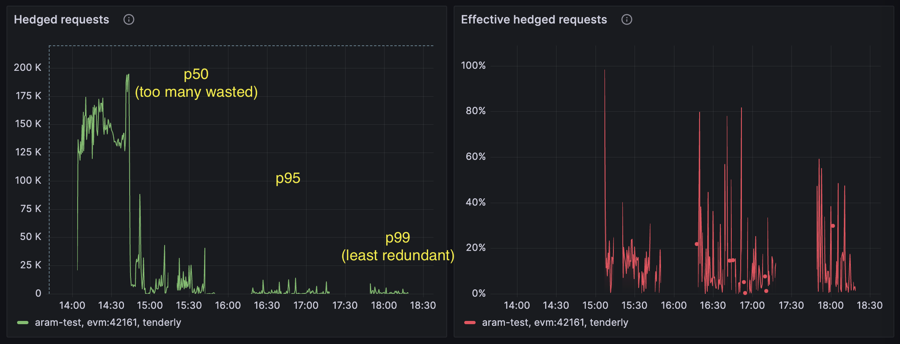

import { LLMsTxtLink, AISection, ConfigTabs, SourceLink, PromptExample } from "../../../components";

<LLMsTxtLink />

# Hedge

Every provider is occasionally slow — and your users feel it as that one spinning page.
Hedging fixes the tail: if an answer hasn't arrived quickly, eRPC silently starts a
backup request on another provider and returns whichever finishes first. Median cost
stays the same; the slow tail collapses.



## Quick taste

Illustrative, not a tuned production config — hedge after 200ms of silence:

<ConfigTabs
  path="projects[].networks[].failsafe[].hedge"
  focusYaml="8-11"
  focusTs="8-9"
  yaml={`projects:
  - id: main
    networks:
      - architecture: evm
        evm: { chainId: 1 }
        failsafe:
          - matchMethod: "*"
            # race a backup request once the primary is 200ms silent
            hedge:
              delay: 200ms
              maxCount: 1`}
  ts={`projects: [{
  id: "main",
  networks: [{
    architecture: "evm",
    evm: { chainId: 1 },
    failsafe: [{
      matchMethod: "*",
      // race a backup request once the primary is 200ms silent
      hedge: { delay: "200ms", maxCount: 1 },
    }],
  }],
}]`}
/>

## Agent reference

Copy one of these prompts into your AI agent session (Claude Code, Cursor, …) — each one
points the agent at this page's machine-readable reference so it can do the work correctly:

<PromptExample
	n={1}
	title="cut tail latency on reads"
	defaultOpen
	prompt={`Reduce p99 latency of my eth_call and eth_getLogs requests even if it creates more
upstream requests, using eRPC's Hedge feature. Use a quantile-based delay so fast
methods don't get needlessly hedged, with sane min/max clamps. Work with my existing eRPC config. Read the full reference first:
https://docs.erpc.cloud/config/failsafe/hedge.llms.txt`}
/>

<PromptExample
	n={2}
	title="audit my hedge cost vs benefit"
	prompt={`Audit the hedging setup in my eRPC config: for each failsafe entry
tell me how often hedges are expected to fire and whether maxCount/min/max make
sense, and which Prometheus metrics to check to measure the hedge win-rate vs the
extra upstream cost (watch out: one registered hedge metric is dormant). Reference:
https://docs.erpc.cloud/config/failsafe/hedge.llms.txt`}
/>

<PromptExample
	n={3}
	title="faster transaction propagation"
	prompt={`I want my eth_sendRawTransaction submissions to propagate to the network faster.
Configure eRPC to broadcast the raw transaction to multiple upstreams in parallel
using Hedge (sendRawTransaction is idempotent so this is safe). Keep other write
methods un-hedged. Work with my existing eRPC config. Reference:
https://docs.erpc.cloud/config/failsafe/hedge.llms.txt`}
/>

<PromptExample
	n={4}
	title="stop wasteful hedges on tx lookups"
	prompt={`My eRPC instance fans out a lot of duplicate eth_getTransactionReceipt /
eth_getTransactionByHash calls when a transaction isn't indexed yet — hedging a
not-found tx just multiplies load. Add a failsafe entry that disables hedging for
these two methods while keeping the catch-all hedge for everything else. Work with my existing eRPC config. Reference: https://docs.erpc.cloud/config/failsafe/hedge.llms.txt`}
/>

<PromptExample
	n={5}
	title="explain hedge behavior I'm seeing"
	prompt={`Many of my eRPC responses have X-ERPC-Hedges: 1 right after deploys, then it calms
down. Explain why (cold-start quantile behavior), and adjust my config so hedges
don't fire immediately on fresh pods. Work with my existing eRPC config. Reference:
https://docs.erpc.cloud/config/failsafe/hedge.llms.txt`}
/>

<AISection
	title="Hedge — full agent reference"
	hint="Everything an agent needs to configure hedging: schema, examples, edge cases, source links."
>

### How it works

The hedge implementation lives in `failsafe/hedge.go` as a generic `RunHedged[R]` function.
At network scope, `networkExecutor.runHedge` wraps the upstream-sweep function and calls
`RunHedged`. The executor composition for non-consensus requests is
`retry(hedge(runUpstreamSweep))`: each retry attempt fires a fresh hedge race. For consensus
requests it is `consensus(retry(hedge(tryOneUpstream)))` where the hedge races individual
upstream slots.

The primary attempt fires immediately (goroutine 0). A pooled timer arms to `delayFn(1)`. If
the primary has not produced a kept result by the time the timer fires, a second goroutine
starts (hedge 1). This repeats until `fired-1 >= maxCount`. All goroutines share a
`siblingCtx` derived from `context.WithCancel(parentCtx)`; when a winner is selected
`cancelAll()` propagates cancellation to every still-running sibling. The result channel is
pre-allocated at `maxCount+1` capacity so goroutine sends never block.

The `keep` predicate decides whether a result ends the race. It returns `false` for
`ErrNoUpstreamsLeftToSelect` (leg exhausted its upstreams — siblings may still win), `false`
for an empty `ErrUpstreamsExhausted`, and `false` for null/empty responses on methods that
are not in the `emptyResultAccept` set (preventing a fast `{"result": null}` from cancelling
siblings with real data). Non-retryable errors — execution reverts, client errors — are kept
immediately as definitive. Any non-null success is kept and `MetricNetworkHedgeWinnerTotal`
fires.

**Delay modes.** Static mode: set `delay` to a plain duration string (`"200ms"`); the hedge
fires exactly that long after the primary starts, and `min`/`max` are ignored when
`quantile == 0`. Adaptive (quantile) mode: set `delay.quantile` between 0 and 1; the
effective delay is `clamp(quantile_value + base, min, max)` using per-method latency data
tracked by the network's `QuantileTracker`. As upstreams warm and cool the delay
self-adjusts. Cold-start (no data yet) falls back to `min` — which `SetDefaults`
auto-populates to `100ms` unless you override it.

**Write-method exclusion.** `runHedge` short-circuits to a plain inner call (no hedging) for
methods identified by `evm.IsNonRetryableWriteMethod`: `eth_sendTransaction`,
`eth_createAccessList`, `eth_submitTransaction`, `eth_submitWork`, `eth_newFilter`,
`eth_newBlockFilter`, `eth_newPendingTransactionFilter`. `eth_sendRawTransaction` is
intentionally NOT excluded — it supports idempotent broadcast under hedge. Composite batch
requests also skip hedging entirely.

**Interaction with retry.** Retry wraps hedge: each retry attempt fires a fresh hedge race.
If the primary fails before the first hedge delay fires, retry acts immediately without
waiting for the timer. If a hedge is already in-flight when the primary fails, retry waits
for the hedge race to complete before deciding whether to retry.

### Config schema

All fields are under `networks[].failsafe[].hedge` (or `upstreams[].failsafe[].hedge`). Struct at <SourceLink file="common/config.go" lines="1489-1492" />.

| Field | Type | Default | Behavior / footguns |
|---|---|---|---|
| `hedge.delay` | `Duration \| AdaptiveDuration` | — (no hedge if absent) | Scalar sets `base` only (static mode). Object `{base, quantile, min, max}` enables adaptive mode. After `SetDefaults`, if `min==0` it becomes `100ms`; if `max==0` it becomes `999s`. Source: <SourceLink file="common/config.go" lines="1490" /> |
| `hedge.delay.base` | `Duration` | `0` | Static addend. When `quantile==0`, this is the entire delay. When `quantile>0`, added to the quantile value before clamping. A scalar shorthand sets this field exclusively. |
| `hedge.delay.quantile` | `float64` | `0` (static mode) | Percentile queried from the per-method `QuantileTracker`. Valid range `[0, 1]`. When `> 0`, `base` or `max` must also be set (enforced by `AdaptiveDuration.validate` at <SourceLink file="common/adaptive_duration.go" lines="129" />). Not allowed for cache-scope failsafe. System template default: `0.7`. Source: <SourceLink file="common/adaptive_duration.go" lines="83-109" /> |
| `hedge.delay.min` | `Duration` | `100ms` (auto-set by `SetDefaults` when `0`) | Floor applied when `quantile>0`. Cold-start fallback when no latency data exists. **Footgun:** manually setting `min: 0` on a quantile-mode spec causes hedges to fire immediately on cold start. Source: <SourceLink file="common/defaults.go" lines="2324-2326" /> |
| `hedge.delay.max` | `Duration` | `999s` (auto-set by `SetDefaults` when `0`) | Ceiling applied when `quantile>0`. Prevents a runaway quantile from deferring the hedge indefinitely. Source: <SourceLink file="common/defaults.go" lines="2327-2329" /> |
| `hedge.maxCount` | `int` | `1` (from `SetDefaults`); system auto-template uses `2` | Max *additional* attempts beyond the primary. `maxCount=1` means 2 total concurrent requests. `maxCount=0` disables hedging silently (`HasHedge()` returns false). Negative values are treated as `0` inside `RunHedged`. **Footgun:** the system template (applied when no `projects` block exists) defaults to `2`; manual configs get `1`. Source: <SourceLink file="common/defaults.go" lines="2331-2337" /> |

**Legacy sibling fields** (backward-compatible, folded into `delay.*` at parse time by <SourceLink file="common/config.go" lines="1555-1571" />):

| Legacy key | Maps to | Notes |
|---|---|---|
| `hedge.quantile` | `hedge.delay.quantile` | Only applied when `delay.quantile == 0` |
| `hedge.minDelay` | `hedge.delay.min` | Only applied when `delay.min == 0` |
| `hedge.maxDelay` | `hedge.delay.max` | Only applied when `delay.max == 0` |

```yaml
# Legacy form — still valid, folded into delay.* at parse time
hedge:
  quantile: 0.7
  minDelay: 100ms
  maxDelay: 2s
  maxCount: 1
```

**Mixed use (object + legacy siblings).** When `delay` is given as an object AND a legacy sibling is present, legacy siblings only fill sub-fields left at zero by the object form. The `delay` object always takes precedence for any sub-field it sets:

```yaml
# delay.base and delay.quantile come from the object;
# minDelay fills delay.min because the object left it at zero;
# the bare quantile: 0.50 is IGNORED because delay.quantile is already 0.95
hedge:
  delay:
    base: 100ms
    quantile: 0.95
  minDelay: 50ms   # → delay.min = 50ms (object did not set min)
  quantile: 0.50   # → IGNORED (delay.quantile already 0.95 from object)
  maxCount: 1
```

Source: <SourceLink file="common/config.go" lines="1507-1571" />

### Worked examples

All patterns below are distilled from real production fleets; comments explain the
non-obvious choices.

**1. The workhorse: p95 quantile hedge on all reads (recommended general shape).** Slow-tail
methods hedge aggressively; consistently fast methods almost never hedge:

<ConfigTabs
  path="projects[].networks[].failsafe[]"
  yaml={`failsafe:
  - matchMethod: "*"
    hedge:
      delay:
        quantile: 0.95   # hedge only the slowest ~5% of each method's traffic
        min: 500ms       # floor: don't race answers that normally return fast,
                         # and don't pile on during block-availability races
        max: 10s         # ceiling: slow methods (heavy getLogs) still get hedged
      maxCount: 1        # one backup is enough for tail-cutting; 2+ is for writes`}
  ts={`failsafe: [{
  matchMethod: "*",
  hedge: {
    delay: { quantile: 0.95, min: "500ms", max: "10s" },
    maxCount: 1,
  },
}]`}
/>

**2. Bimodal latency (cache-hit ~5ms vs cache-miss ~1s).** A fixed delay either races every
cache hit (too low) or never helps misses (too high). Quantile mode with clamps handles both
populations automatically — this is the canonical case for `quantile + min + max`.

**3. Aggressive clamps for hash-addressed lookups.** During live indexing,
`eth_getBlockByHash` may return data on only some nodes — racing another node quickly is
exactly right, so the clamps tighten by an order of magnitude:

<ConfigTabs
  path="projects[].networks[].failsafe[]"
  yaml={`failsafe:
  - matchMethod: "eth_getBlockByHash"
    hedge:
      delay:
        quantile: 0.95
        min: 100ms   # much lower floor: a null here is likely "this node doesn't
                     # have it yet" — racing another node fast is the whole point
        max: 500ms
      maxCount: 1`}
  ts={`failsafe: [{
  matchMethod: "eth_getBlockByHash",
  hedge: {
    delay: { quantile: 0.95, min: "100ms", max: "500ms" },
    maxCount: 1,
  },
}]`}
/>

**4. Deliberately NO hedge for tx lookups.** A null `eth_getTransactionReceipt` /
`eth_getTransactionByHash` usually means the tx isn't propagated/indexed yet —
parallel-blasting more upstreams just multiplies load for the same null. Place the
exclusion entry BEFORE the catch-all (first matching entry wins):

<ConfigTabs
  path="projects[].networks[].failsafe[]"
  yaml={`failsafe:
  - matchMethod: "eth_getTransactionByHash|eth_getTransactionReceipt"
    retry:
      maxAttempts: 2
      delay: 500ms      # ~one block of patience instead of a hedge fan-out
    # no hedge key at all — hedging is off for this entry
  - matchMethod: "*"
    hedge:
      delay: { quantile: 0.95, min: 500ms, max: 10s }
      maxCount: 1`}
  ts={`failsafe: [
  {
    matchMethod: "eth_getTransactionByHash|eth_getTransactionReceipt",
    retry: { maxAttempts: 2, delay: "500ms" },
  },
  {
    matchMethod: "*",
    hedge: { delay: { quantile: 0.95, min: "500ms", max: "10s" }, maxCount: 1 },
  },
]`}
/>

**5. Hedged broadcast for `eth_sendRawTransaction`.** The one write method hedging does NOT
exclude — broadcasting an identical signed tx to several upstreams is idempotent and speeds
up mempool propagation:

<ConfigTabs
  path="projects[].networks[].failsafe[]"
  yaml={`failsafe:
  - matchMethod: "eth_sendRawTransaction"
    hedge:
      delay:
        quantile: 0.95
        min: 50ms    # near-immediate: goal is propagation, not tail-cutting
        max: 1s
      maxCount: 2    # 3 upstreams total receive the tx`}
  ts={`failsafe: [{
  matchMethod: "eth_sendRawTransaction",
  hedge: {
    delay: { quantile: 0.95, min: "50ms", max: "1s" },
    maxCount: 2,
  },
}]`}
/>

**6. Static hedge on cache-connector reads.** Cache connectors take their own failsafe via
`failsafeForGets` / `failsafeForSets`; hedge `quantile` is rejected at this scope — use a
static delay to race a slow shared-cache read (e.g. a remote gRPC cache connector):

<ConfigTabs
  path="database.evmJsonRpcCache.connectors[].failsafeForGets[]"
  yaml={`connectors:
  - id: remote-cache
    driver: grpc
    failsafeForGets:
      - matchMethod: "*"
        timeout:
          duration: 400ms  # a cache read must be fast or not worth it —
                           # past this, going straight to upstreams is cheaper
        hedge:
          delay: 100ms     # static: quantile is rejected at cache scope, and
                           # connector latency is stable enough to hardcode
          maxCount: 1
        retry:
          maxAttempts: 2
          delay: "0"`}
  ts={`connectors: [{
  id: "remote-cache",
  driver: "grpc",
  failsafeForGets: [{
    matchMethod: "*",
    timeout: { duration: "400ms" },
    hedge: { delay: "100ms", maxCount: 1 },
    retry: { maxAttempts: 2, delay: "0" },
  }],
}]`}
/>

### Request/response behavior

- Each hedge fire (idx &gt; 0) increments both `NetworkAttempts` and `NetworkHedges`; the
  final response carries `X-ERPC-Attempts` and `X-ERPC-Hedges` headers reflecting them.
  The primary attempt does NOT increment `NetworkHedges`. [<SourceLink file="erpc/network_executor.go" lines="631-641" />]
- Losing legs are cancelled via context; their responses are released back to buffer pools
  (`r.Release()`), never surfaced to the client. [<SourceLink file="erpc/network_executor.go" lines="626-630" />]
- A hedge race that ends with a non-retryable error (e.g. execution revert) returns that
  error verbatim — hedging never converts error shapes.
- `MetricNetworkHedgeWinnerTotal` fires for every kept result, including when the primary
  wins without any hedge having fired. It identifies which upstream won the race.
  [<SourceLink file="erpc/network_executor.go" lines="553-570" />]
- When all legs return unkept results, the final response is the **last** unkept result
  (not the first); each new unkept result replaces the previous `lastResult` until the
  race ends. [<SourceLink file="failsafe/hedge.go" lines="243-253" />]
- Cancelled legs produce `ErrUpstreamHedgeCancelled` (error code #33) internally, with
  the message `"hedged request cancelled in favor of another upstream response"` and
  `upstreamId` in details. This error is retryable toward the network (U:yes N:yes); in
  `ErrUpstreamsExhausted.SummarizeCauses` it appears in the `cancelled` bucket, producing
  log summaries like `"exhausted(cancelled=2)"`. [<SourceLink file="common/errors.go" lines="1447-1462" />] [<SourceLink file="common/errors.go" lines="1000-1002" />]

### Best practices

- Prefer **quantile mode** (`quantile: 0.7`, `min: 100ms`, `max: 2s`) over static delays —
  static delays go stale as providers change; quantile self-adjusts per method.
- Never set `min: 0` in quantile mode: cold-start hedges would fire immediately, doubling
  request volume right after deploys.
- Budget for hedge cost with `maxCount: 1` first; raise to 2 only when
  `erpc_network_hedge_winner_total` shows hedges winning often enough to matter.
- Alert/dashboard on `erpc_network_hedged_request_total` vs total request rate to watch the
  hedge tax (each win is also a paid duplicate request).
- Don't build alerts on `erpc_network_hedge_delay_seconds` — it is registered but dormant
  (no production Observe call).
- Remember the **two different defaults**: the built-in system template uses `maxCount: 2`;
  manually-written failsafe blocks get `maxCount: 1` from SetDefaults.
- Hedging is upstream-cost-bounded, not free: combine with [rate limiters](/config/rate-limiters)
  on expensive vendors so hedge bursts can't blow a provider budget.

### Edge cases & gotchas

1. **Static `base` ignores `min`/`max`.** When `quantile==0`, `Resolve` returns `base` unchanged regardless of `min`/`max`. A `delay: 5ms` WILL fire at 5ms even if `min=100ms` is set. Source: <SourceLink file="common/adaptive_duration.go" lines="88-89" />
2. **Cold start falls to `min`, not `base`.** When `quantile>0` and no latency data exists, `Resolve` returns `Min` (not `Base`). If `min==0`, hedges fire immediately. `SetDefaults` auto-sets `min=100ms` but a manually-zero `min` bypasses this guard. Source: <SourceLink file="common/adaptive_duration.go" lines="96-98" />
3. **`maxCount: 0` disables hedging silently.** `HasHedge()` returns `false`. A config with only `delay` and no `maxCount` gets `maxCount=1` from `SetDefaults` (enabled). Explicit `maxCount: 0` disables it. Source: <SourceLink file="erpc/network_executor.go" lines="126-131" />
4. **Null responses do not win for most methods.** `{"result": null}` from one leg does NOT cancel siblings for `eth_getBlockByNumber`, `eth_getTransactionByHash`, `eth_getTransactionReceipt` (not in `emptyResultAccept`). For `eth_getLogs`, `eth_call`, empty IS kept. Source: <SourceLink file="erpc/network_executor.go" lines="591-622" />
5. **Non-retryable errors win immediately.** An execution-revert from any leg is `keep=true` and cancels siblings. This mirrors upstream-sweep short-circuit behavior.
6. **Hedge fires continue after primary error.** The timer schedule is independent of primary success/failure. A fast-failing primary does not suppress subsequent hedge attempts. Source: <SourceLink file="failsafe/hedge.go" lines="216" />
7. **Channel overflow protection.** Result channel is sized `maxCount+1`; the `default` branch in the goroutine's send handles the theoretically-impossible overflow by releasing the result. Source: <SourceLink file="failsafe/hedge.go" lines="127-136" />
8. **Composite requests skip hedging.** Batch/composite requests bypass `runHedge` entirely — batch fan-out has its own parallelism. Source: <SourceLink file="erpc/network_executor.go" lines="524" />
9. **`ErrUpstreamHedgeCancelled` is retryable.** Cancelled hedge legs produce this error (U:yes N:yes). If a full hedge race fails, outer retry is not blocked because `IsRetryableTowardNetwork` returns `true`. Source: <SourceLink file="common/errors.go" lines="1447-1462" />
10. **`erpc_network_hedge_delay_seconds` is dormant.** The metric is registered but has no production `Observe` call — only a test touches it. Do not alert on it. Source: <SourceLink file="telemetry/metrics.go" lines="813" />
11. **System template vs. manual default.** The built-in project template (applied when `projects` is absent) sets `maxCount=2`. Manually-written `networks[].failsafe[].hedge` blocks get `maxCount=1` from `SetDefaults`. These are different defaults. Source: <SourceLink file="common/defaults.go" lines="137-141" />
12. **Single upstream + hedge = primary wins eventually.** The hedge leg gets `ErrNoUpstreamsLeftToSelect`, `keep` returns `false`, and the race waits for the primary; no error is surfaced. Source: `erpc/http_server_hedge_test.go` (SingleUpstreamHedgeContinuesPrimary).
13. **Timer pool stale-tick safety.** Hedge timers are drawn from a `sync.Pool` (`hedgeTimerPool`) to avoid per-request `time.NewTimer` allocations. `releaseHedgeTimer` calls `t.Stop()` and drains `t.C` with a non-blocking select before returning to the pool — without this, the next borrower could fire immediately on a stale tick from a previous lifecycle. Source: <SourceLink file="failsafe/hedge.go" lines="9-60" />
14. **Delay is per-method, not per-attempt-index.** `delayFn` is called with a 1-based hedge index for each fire, but in the network executor the same `AdaptiveDuration.ResolveForRequest(req)` is returned for every index — the delay is determined by observed per-method latency, not by which hedge attempt is firing. The index parameter exists for extensibility. Source: <SourceLink file="erpc/network_executor.go" lines="542-544" />

### Observability

| Metric | Type | Labels | When it fires |
|---|---|---|---|
| `erpc_network_hedged_request_total` | counter | project, network, upstream, category, attempt, finality, user, agent_name | Each time a hedge request fires (primary counted when `hedges > 0`) |
| `erpc_network_hedge_discards_total` | counter | project, network, upstream, category, attempt, hedge, finality, user, agent_name | Hedge goroutine's context was cancelled by a sibling winner |
| `erpc_network_hedge_winner_total` | counter | project, network, upstream, category, finality | Each hedge race that produced a kept result; identifies which upstream won |
| `erpc_network_hedge_delay_seconds` | histogram | project, network, category, finality | **Dormant** — registered with buckets `[0.01, 0.03, 0.05, 0.2, 0.3, 0.5, 0.7, 1, 3]`, no production `Observe` call (only a test touches it) |
| `erpc_upstream_selection_total{reason="hedge"}` | counter | project, network, upstream, category, reason, finality | Upstream selected for a hedge attempt |
| `erpc_upstream_attempt_outcome_total{is_hedge="true"}` | counter | project, network, upstream, category, outcome, is_hedge, is_retry, finality | Hedge attempt terminal outcome |

### Source code entry points

- [`failsafe/hedge.go:L111-L255`](https://github.com/erpc/erpc/blob/main/failsafe/hedge.go#L111-L255) — `RunHedged[R]`: generic race loop, timer pool, `siblingCtx`, winner selection
- [`failsafe/hedge.go:L9-L60`](https://github.com/erpc/erpc/blob/main/failsafe/hedge.go#L9-L60) — `hedgeTimerPool` (`sync.Pool`): timer borrow/release with stale-tick drain
- [`erpc/network_executor.go:L516-L645`](https://github.com/erpc/erpc/blob/main/erpc/network_executor.go#L516-L645) — `runHedge`: wires `AdaptiveDuration.ResolveForRequest` as `delayFn`, implements `keep`, `release`, `OnFire` hooks
- [`erpc/network_executor.go:L141-L203`](https://github.com/erpc/erpc/blob/main/erpc/network_executor.go#L141-L203) — `Run` / `runRetryHedge`: composition ordering (`retry(hedge(runUpstreamSweep))`)
- [`erpc/networks.go:L1284-L1306`](https://github.com/erpc/erpc/blob/main/erpc/networks.go#L1284-L1306) — `MetricNetworkHedgedRequestTotal` increment + discard detection (`ErrEndpointRequestCanceled` → `recordHedgeDiscard`)
- [`erpc/networks.go:L1883-L1903`](https://github.com/erpc/erpc/blob/main/erpc/networks.go#L1883-L1903) — `recordHedgeDiscard`: increments `MetricNetworkHedgeDiscardsTotal`, returns `ErrUpstreamHedgeCancelled`
- [`common/config.go:L1489-L1571`](https://github.com/erpc/erpc/blob/main/common/config.go#L1489-L1571) — `HedgePolicyConfig` struct, YAML/JSON unmarshal, `applyLegacySiblings`
- [`common/adaptive_duration.go:L83-L109`](https://github.com/erpc/erpc/blob/main/common/adaptive_duration.go#L83-L109) — `AdaptiveDuration.Resolve`: static/quantile/cold-start branches
- [`common/defaults.go:L2307-L2340`](https://github.com/erpc/erpc/blob/main/common/defaults.go#L2307-L2340) — `HedgePolicyConfig.SetDefaults`; constants `defaultHedgeMinDelay=100ms`, `defaultHedgeMaxDelay=999s`
- [`common/errors.go:L1447-L1462`](https://github.com/erpc/erpc/blob/main/common/errors.go#L1447-L1462) — `ErrUpstreamHedgeCancelled` / `ErrCodeUpstreamHedgeCancelled` (error code #33)
- [`common/errors.go:L955-L1035`](https://github.com/erpc/erpc/blob/main/common/errors.go#L955-L1035) — `ErrUpstreamsExhausted.SummarizeCauses`; `cancelled` bucket for `ErrCodeUpstreamHedgeCancelled` at L1000-L1002
- [`architecture/evm/util.go:L7-L17`](https://github.com/erpc/erpc/blob/main/architecture/evm/util.go#L7-L17) — `IsNonRetryableWriteMethod`
- [`erpc/http_server_hedge_test.go`](https://github.com/erpc/erpc/blob/main/erpc/http_server_hedge_test.go) — behavior-locking tests incl. single-upstream race semantics, retry interaction tests

### Related pages

- [Retry](/config/failsafe/retry) — wraps hedge; each retry attempt is a fresh hedge race.
- [Timeout](/config/failsafe/timeout) — bounds the whole race from outside.
- [Selection & scoring](/config/projects/selection-policies) — decides which upstream each leg gets.
- [Rate limiters](/config/rate-limiters) — caps the hedge tax on expensive vendors.
- [Survive provider outages](/use-cases/survive-provider-outages) — the outcome this feature serves.

</AISection>
