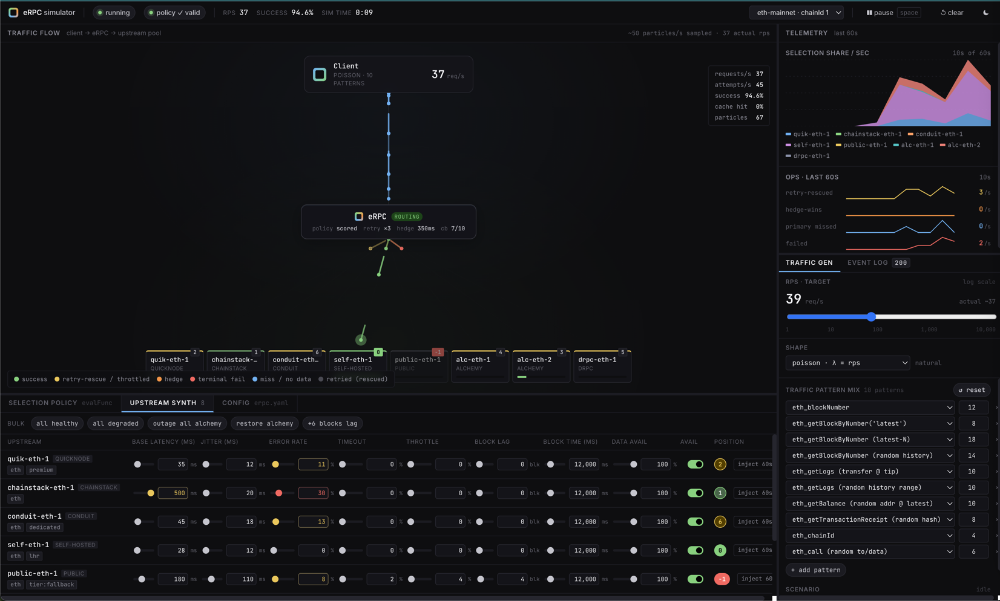

import { LLMsTxtLink, AISection, SourceLink, PromptExample } from "../../components";

<LLMsTxtLink />

# Simulator

Reproduce production routing failures, develop selection policies, and watch failover dynamics unfold — all from a browser tab, with no provider credentials, no cloud account, and no live network. Every dot on screen is a real `Network.Forward()` call; only the upstream servers and the traffic generator are synthetic. `go run ./cmd/erpc-simulator`, open `http://127.0.0.1:8080`, and start breaking things.



## Agent reference

Copy one of these prompts into your AI agent session (Claude Code, Cursor, …) — each one
points the agent at this page's machine-readable reference so it can do the work correctly:

<PromptExample
	n={1}
	title="reproduce a production failover chain locally before deploying"
	defaultOpen
	prompt={`I want to run the eRPC simulator to verify my retry and hedge config handles a
provider outage correctly before I deploy to production — no provider credentials
needed. Walk me through starting the simulator, applying my eRPC config,
and using the vendor-region-outage scenario to check failover. Read the reference:
https://docs.erpc.cloud/reference/simulator.llms.txt`}
/>

<PromptExample
	n={2}
	title="develop and validate a new selection policy offline"
	prompt={`I want to write a new eRPC selection policy and iterate on it in the simulator
without touching production. Explain how to paste my JS policy into the editor,
use the gradual-degradation scenario (90s) to stress-test it, and read the
policy-history drawer steps to confirm the degrading upstream loses rank within
my target window. Reference:
https://docs.erpc.cloud/reference/simulator.llms.txt`}
/>

<PromptExample
	n={3}
	title="capture a forensic dump for offline analysis"
	prompt={`I want to capture a JSONL forensic log of a tricky routing edge case in the eRPC
simulator so I can slice it with jq later without re-running the scenario. Show me
the -dump-file flag usage, the companion AGENTS.md queries, and the jq recipes to
filter failed requests and per-attempt errors. Reference:
https://docs.erpc.cloud/reference/simulator.llms.txt`}
/>

<PromptExample
	n={4}
	title="tune synthetic upstream knobs to match my production error profile"
	prompt={`My production upstreams have specific error rates, latency distributions, and block
lag values that I want to replicate in the simulator so my policy tests are realistic.
Explain the UpstreamKnobs schema (base latency, jitter, errorRate, timeoutRate,
throttleRate, blockLag, dataAvailability) and how to set them via the UI or
set-knob WebSocket messages. Reference:
https://docs.erpc.cloud/reference/simulator.llms.txt`}
/>

<AISection title="Simulator — full agent reference">

### How it works

**Architecture overview.** The simulator is a single Go binary (`cmd/erpc-simulator/main.go`) embedding all browser assets via `//go:embed all:web`. It binds one HTTP server on `127.0.0.1:8080` (configurable via `-addr`) serving static assets at `/` and a WebSocket endpoint at `/ws`. Behind the WebSocket lives an `Orchestrator` that owns the real `*erpc.ERPC` instance, a synthetic `UpstreamHub` HTTP server (on a random loopback port), and rolling stats counters. [<SourceLink file="internal/simulator/orchestrator.go" lines="51-95" />]

**Traffic generation.** Traffic generation is browser-side. The JavaScript runtime ticks at the configured RPS and for each tick builds a `send-batch` WebSocket frame. The backend's `Session.execute` goroutine calls `Orchestrator.Execute(ctx, method, params)` for each item, which calls `net.Forward(rctx, req)` — eRPC's real network handler. The full request path runs: selection policy → failsafe (retry/timeout/hedge/consensus) → HTTP transport to the fake upstream → response parsing. After `Forward` returns, `Execute` reads `req.ExecState().UpstreamAttemptLog()`, builds a `TraceEvent`, and queues it for the 50ms `traces` WebSocket push. [<SourceLink file="internal/simulator/orchestrator.go" lines="597-708" />]

**UpstreamHub.** A single `http.Server` multiplexed across N synthetic upstreams at paths `/sim/<id>`. Per request: (1) looks up `UpstreamKnobs` under RLock; (2) if `Available=false`, immediately returns HTTP 503; (3) rolls three thresholds in order — throttle rate (fast 429, no sleep), timeout rate (hang 30s after sleep), error rate (HTTP 500/502/503 or JSON-RPC -32000/-32603 in a 5-way split); (4) on success, calls `synthResult` to produce a plausible method-specific JSON-RPC response. Latency is sampled as `max(1ms, base + |gaussian()| × jitter × 0.6)`. [<SourceLink file="internal/simulator/upstream_sim.go" lines="401-468" />]

**Block model.** Each upstream maintains an independent `atomic.Int64` head, advanced by a single hub-wide goroutine ticking every 250ms. Per-upstream `BlockTimeMs` (default 12,000ms) controls step size. `BlockLag` is subtracted from head at response time. A hub-level `hubHead` tracks the maximum across all upstreams; new upstreams seed at `22_000_000` (plausible mainnet). Block timestamps use `simGenesisUnix + block × 12s` so the health tracker's block-time EMA converges correctly. [<SourceLink file="internal/simulator/upstream_sim.go" lines="135-177" />]

**Data availability model.** For sparse-data methods (`eth_getTransactionReceipt`, `eth_getBlockByHash`, `eth_getLogs`, `eth_getTransactionByHash`), a deterministic FNV-like hash of `(upstreamID, method, params)` determines whether the upstream "has" the data. Per-method baselines: receipt/tx 80%, block-by-hash 90%, getLogs 85%. The `DataAvailability` knob (0–1) multiplies the baseline; at exactly 1.0 it always returns data (bypasses baseline); at 0 it always misses. [<SourceLink file="internal/simulator/upstream_sim.go" lines="613-648" />]

**Seed configuration.** On first boot the orchestrator uses `SeedYAML` — eight upstreams (alc-eth-1, alc-eth-2, drpc-eth-1, quik-eth-1, chainstack-eth-1, conduit-eth-1, self-eth-1, public-eth-1) on network `evm:1`. `scoreMetricsWindowSize: 10s` and `selectionPolicy.evalInterval: 1s` are deliberately tighter than production so health dynamics are visible in seconds, not minutes. The browser's "↺ default" button restores this YAML. [<SourceLink file="internal/simulator/config.go" lines="12-22" />]

**Config apply flow.** When the browser sends `apply-config`, the YAML must have the `{SELECTION_POLICY_FUNC}` placeholder already substituted by the frontend. The backend: (1) `DecodeConfigYAML` — YAML decode + legacy migration, `KnownFields(true)` (typos are hard errors); (2) `RewriteEndpoints` — overwrites every upstream endpoint to `http://<hubAddr>/sim/<id>`, forces vendor type to `evm`; (3) `FinalizeConfig` — `SetDefaults` + `Validate`; (4) `syncUpstreamKnobs` — creates/refreshes/orphan-drops knob entries; (5) creates a fresh `erpc.ERPC`, bootstraps it, enables policy step log; (6) re-applies pause state. Previous eRPC instance is replaced atomically; in-flight requests against the old pointer complete normally. [<SourceLink file="internal/simulator/orchestrator.go" lines="251-298" />]

**Selection policy live edit.** `apply-policy` compiles the JS source via `common.CompileProgram` (sobek), injects the source into the stored YAML via `injectPolicyIntoYAML`, and re-boots. `validate-policy` compiles only — no apply. The frontend sends `validate-policy` on every debounced keystroke and `apply-policy` on explicit "Apply." The policy step log is always enabled (`net.SetPolicyStepLogEnabled(true)`) so the policy-history drawer shows the full per-step chain trail on every eval tick. [<SourceLink file="internal/simulator/orchestrator.go" lines="396-421" />]

**Scenarios.** Six built-in scripted scenarios automate upstream degradation without manual slider work, advancing via a 250ms `scenarioLoop` ticker:

- `gradual-degradation` (90s) — raises `alc-eth-1` error rate 5% → 70%
- `vendor-region-outage` (60s) — makes Alchemy us-east region unavailable, then restores
- `traffic-spike` (60s) — degrades all upstream latency and error rates, then recovers
- `hedge-saturator` (60s) — increases jitter, then pins specific upstreams to high latency
- `policy-exclude-cascade` (50s) — pushes distinct failure modes onto three upstreams
- `slow-network` (60s) — triples latency and doubles jitter on all upstreams

Each scenario step calls the same `Orchestrator.UpdateUpstream` code path as manual slider changes. [<SourceLink file="internal/simulator/scenarios.go" lines="114-145" />]

**Knob live tuning.** Every synthetic upstream exposes `UpstreamKnobs` — latency, error rate, timeout rate, throttle rate, block lag, data availability, and a hard on/off toggle — changeable live via `set-knob` WebSocket messages without reloading the config. Default knob values are biased by tags: `premium` starts at `base=35ms, error=0.003`; `tier:fallback` starts at `base=180ms, error=0.080, blockLag=4`. The "inject 60s failure" button forces `errorRate ≥ 0.9, timeoutRate ≥ 0.3` for 60 seconds via `InjectFailureUntilMs`.

**Pause.** `SetPaused(true)` stops `Execute` from forwarding requests (returns nil) AND pauses the policy engine's eval ticker via `net.SetPolicyEnginePaused(true)`. This keeps position/score pills in the upstream panel stable while paused. Both flags re-sync when a config or policy apply lands mid-pause — the new engine starts un-paused and is immediately re-paused. [<SourceLink file="internal/simulator/orchestrator.go" lines="219-234" />] [<SourceLink file="internal/simulator/orchestrator.go" lines="289-296" />]

**Dump file.** Pass `-dump-file path/to/run.jsonl` to capture a JSONL forensic log. Every observable event is recorded: `boot`, `config.snapshot`, `config.apply`, `policy.apply`, `knob.change`, `knob.inject`, `scenario.start`, `scenario.stop`, `scenario.event`, `paused`, `request`, `stats`. The `request` event carries the full `TraceEvent` (per-attempt log, selection trail, outcome) plus raw params and JSON body. A companion `*.AGENTS.md` is written at open with field descriptions and idiomatic `jq` queries. Buffer is 64KB, flushed every 1s; a crash loses at most ~1s of trailing events. [<SourceLink file="internal/simulator/dump.go" />]

**Rolling stats and WebSocket cadence.** `stats` frames are sent every 200ms; `traces` are batched every 50ms with a cap of 256 items per flush. The session's outbound channel holds 256 frames; when full, frames are dropped silently — the UI is lossy by design. A 1-second bucket rolls every second; `Stats()` returns the previous second's completed bucket for the RPS display. Per-upstream latency percentiles (p50/p70/p90/p95) keep the last 300 samples. Policy scores and health tracker metrics are read live from the engine and tracker on every `Stats()` call — the simulator has no parallel bookkeeping for these. [<SourceLink file="internal/simulator/orchestrator.go" lines="804-970" />] [<SourceLink file="internal/simulator/ws.go" lines="19-64" />]

### Config schema

The simulator accepts four CLI flags. Configuration of the eRPC instance is done through the browser YAML editor or `apply-config` WebSocket messages — there is no separate simulator config file.

| Flag | Type | Default | Behavior / footguns |
|---|---|---|---|
| `-addr` | `string` | `"127.0.0.1:8080"` | Bind address for the HTTP server and `/ws` WebSocket endpoint. Source: <SourceLink file="cmd/erpc-simulator/main.go" lines="83" /> |
| `-log-level` | `string` | `"warn"` | zerolog level for the in-process eRPC instance. Valid values: `trace`, `debug`, `info`, `warn`, `error`. Source: <SourceLink file="cmd/erpc-simulator/main.go" lines="84" /> |
| `-web-dir` | `string` | `""` (embedded assets) | When non-empty, serve UI assets from this directory instead of the embedded filesystem. Enables hot-reload of JSX/CSS without Go rebuilds. Source: <SourceLink file="cmd/erpc-simulator/main.go" lines="86-91" /> |
| `-dump-file` | `string` | `""` (disabled) | JSONL forensic log path. A companion `*.AGENTS.md` is written once at open. Append-only: restarts accumulate multiple `boot` events. Source: <SourceLink file="cmd/erpc-simulator/main.go" lines="93-99" /> |

#### UpstreamKnobs schema

All fields are live-tunable via `set-knob` WebSocket messages (`UpstreamKnobPatch`; pointer fields, nil = unchanged). Struct at <SourceLink file="internal/simulator/types.go" lines="47-77" />.

| Field | JSON key | Type | Default (standard) | Default (premium tag) | Default (fallback tag) | Behavior / footguns |
|---|---|---|---|---|---|---|
| `ID` | `id` | string | (from YAML) | — | — | Upstream identity key. Immutable after boot. |
| `Vendor` | `vendor` | string | (from YAML vendorName) | — | — | Display name in the upstream panel. |
| `Tags` | `tags` | `[]string` | (from YAML) | — | — | Propagated to health tracker and policy stdlib `u.tags`. |
| `Endpoint` | `endpoint` | string | `http://<hubAddr>/sim/<id>` | — | — | Loopback URL rewritten by `RewriteEndpoints` at every config apply. Source: <SourceLink file="internal/simulator/types.go" lines="50" /> |
| `BaseLatencyMs` | `base` | `float64` | `50` | `35` | `180` | Mean latency in ms. Latency model: `max(1, base + \|gaussian()\| × jitter × 0.6)`. Source: <SourceLink file="internal/simulator/defaults.go" lines="14" /> |
| `JitterMs` | `jitter` | `float64` | `20` | `12` | `110` | Gaussian sigma multiplier for latency variance. Source: <SourceLink file="internal/simulator/defaults.go" lines="15" /> |
| `ErrorRate` | `error` | `float64` | `0.01` | `0.003` | `0.080` | Probability [0..1] of an error response. Mix: HTTP 500, 502, 503, JSON-RPC -32000, -32603. Source: <SourceLink file="internal/simulator/defaults.go" lines="16" /> |
| `TimeoutRate` | `timeoutRate` | `float64` | `0.002` | `0.002` | `0.020` | Probability [0..1] of hanging 30s. Evaluated after the throttle check. Source: <SourceLink file="internal/simulator/defaults.go" lines="17" /> |
| `ThrottleRate` | `throttleRate` | `float64` | `0.002` | `0.002` | `0.040` | Probability [0..1] of HTTP 429 (fast reject, no sleep). First check in outcome model. Source: <SourceLink file="internal/simulator/defaults.go" lines="18" /> |
| `BlockLag` | `blockLag` | `int` | `0` | `0` | `4` | Blocks behind hub head reported in `eth_blockNumber` responses. Source: <SourceLink file="internal/simulator/defaults.go" lines="19" /> |
| `BlockTimeMs` | `blockTimeMs` | `int` | `12000` | `12000` | `12000` | Milliseconds between block advances. Zero or negative treated as 12000. Source: <SourceLink file="internal/simulator/defaults.go" lines="20" /> |
| `Available` | `available` | `bool` | `true` | `true` | `true` | If false, upstream immediately returns HTTP 503 without any outcome roll. Source: <SourceLink file="internal/simulator/defaults.go" lines="21" /> |
| `DataAvailability` | `dataAvailability` | `float64` | `1.0` | `1.0` | `1.0` | Multiplier [0..1] on per-method sparse-data baselines. 1.0 = always has data (bypasses baseline). 0 = always misses. Source: <SourceLink file="internal/simulator/defaults.go" lines="22-23" /> |
| `InjectFailureUntilMs` | `injectFailureUntilMs` | `int64` | `0` (disabled) | — | — | Unix-ms deadline for injected failure override: forces `errorRate ≥ 0.9, timeoutRate ≥ 0.3`. Source: <SourceLink file="internal/simulator/types.go" lines="69-77" /> |

**Default bias rules** (`internal/simulator/defaults.go`):
- Tag `premium`: `base=35`, `jitter=12`, `error=0.003`
- Tag `dedicated`: `base=45`, `jitter=18`, `error=0.005`
- Tag `tier:fallback`: `base=180`, `jitter=110`, `error=0.080`, `timeoutRate=0.020`, `throttleRate=0.040`, `blockLag=4`
- Vendor `self-hosted`: `base=28`, `jitter=12`, `error=0.02`
- Vendor `public` (no fallback tag): `error=0.08`, `base=180`, `jitter=110`, `blockLag=4`

### Worked examples

**1. Reproduce a production failover chain offline.** You want to confirm that when your primary drops, the retry/hedge combo still routes cleanly without thundering-herd. Set `alc-eth-1` to `available=false` in the knob panel and watch the traces drawer. When you see `selReason: "retry"` or `outcome: "hedge-win"` for all requests, failover is working. Then start `vendor-region-outage` to let the scenario automate the degradation/restore cycle and verify score recovery:

```
start-scenario: vendor-region-outage
# watch policy-history frames: excluded[] should clear within ~10s of restore
```

**2. Tune selection policy against bimodal data availability.** You have premium and fallback upstreams with different data fill rates; you want your policy to prefer upstreams that actually have the data. Set `dataAvailability=0.3` on fallback upstreams and `dataAvailability=1.0` on premium. Run `eth_getTransactionReceipt` traffic and watch the `traces` frame — `selReason: "sweep"` on the first attempt means the policy fell back for a data miss. Adjust your policy's `missRate` weight until sweeps disappear from primary attempts.

**3. Validate a new selection policy before deploying.** Paste your policy JS into the policy editor, click Validate to compile-check, then Apply. Run the `gradual-degradation` scenario (90s) while watching the policy-history drawer — the `steps[]` chain shows exactly which upstream attribute triggered each position change. Compare score trajectories before and after to confirm the degrading upstream loses rank within your target latency window.

**4. Offline forensic replay with `-dump-file`.** Run a session that exercises a tricky edge case, then exit:

```bash
go run ./cmd/erpc-simulator -dump-file run.jsonl
# ... reproduce the issue ...
# Ctrl-C
jq 'select(.kind=="request" and .body.outcome=="fail")' run.jsonl | head -20
jq 'select(.kind=="request") | .body.attempts[] | select(.error != null)' run.jsonl
```

The `*.AGENTS.md` companion lists every queryable field and idiomatic `jq` recipes for slicing by outcome, upstream, and method.

### Request/response behavior

**WebSocket protocol — client → server frames:**

```json
{"kind":"hello"}
{"kind":"send-batch","items":[{"id":123,"method":"eth_blockNumber","params":[]}]}
{"kind":"send-one","req":{"id":123,"method":"eth_blockNumber","params":[]}}
{"kind":"set-knob","id":"alc-eth-1","patch":{"error":0.1,"base":200}}
{"kind":"apply-policy","src":"<JS source>"}
{"kind":"validate-policy","src":"<JS source>"}
{"kind":"apply-config","yaml":"<YAML with policy inlined>"}
{"kind":"validate-config","yaml":"<YAML>"}
{"kind":"set-paused","paused":true}
{"kind":"start-scenario","name":"gradual-degradation"}
{"kind":"stop-scenario"}
```

**WebSocket protocol — server → client frames:**

```json
{"kind":"snapshot","body":{"yaml":"...","defaultYaml":"...","upstreams":[...],"policy":"...","defaultPolicy":"...","paused":false,"serverTimeMs":1234567890}}
{"kind":"stats","body":{"tick":...,"actualRps":...,"lastSecondTotal":...,"lastSecondSucc":...,"lastSecondErr":...,"lastSecondCache":...,"lastSecondRetryOk":...,"lastSecondHedge":...,"lastSecondMiss":...,"perUpstreamLastS":{...},"upstreams":{...},"policyLastSwitchMs":...,"scenario":...}}
{"kind":"traces","body":{"items":[...]}}
{"kind":"policy-history","body":{"items":[...]}}
{"kind":"policy-result","body":{"ok":true,"compiledAt":1234567890}}
{"kind":"policy-validate-result","body":{"ok":false,"error":"ReferenceError: x is not defined"}}
{"kind":"config-result","body":{"ok":true,"appliedAt":1234567890}}
{"kind":"config-validate-result","body":{"ok":false,"error":"yaml decode: ..."}}
{"kind":"knob-changed","body":{}}
{"kind":"error","body":{"msg":"unknown kind: foo"}}
```

`TraceEvent.outcome` values: `"ok"`, `"retry-ok"`, `"hedge-win"`, `"fail"`, `"cache-hit"`. Source: <SourceLink file="internal/simulator/types.go" lines="107" />

`TraceAttempt.selReason` values: `"primary"`, `"retry"`, `"hedge"`, `"consensus_slot"`, `"sweep"`. Source: <SourceLink file="internal/simulator/types.go" lines="165" />

`StatsFrame.upstreams` map values (`UpstreamStatsRow`): `errorRate`, `throttleRate`, `misbehaviorRate` from the health tracker; `p50`, `p70`, `p90`, `p95` in ms; `blockHeadLag`, `finalizationLag` in blocks; `blockHeadLagSeconds`, `finalizationLagSeconds` (block count × tracker's EMA block-time in seconds); `cordoned`, `cordonedReason`; `score` from `Engine.GetScores("*")`; `position` (0 = primary, 1..N = fallback, -1 = excluded); `selectionsLast` (count in previous 1-second bucket).

`PolicyDecisionFrame` (in `policy-history`): `id` (slug formatted as `<network>/<method>/<unix-ms>`), `steps[]` (stdlib step chain — always populated in simulator, disabled in production), `metrics` (per-upstream metric snapshot the eval saw at that tick), `perUpstreamScore` (JS-produced scores from that tick), `excluded[]` (excluded upstreams with step and reason).

**Outcome roll order** (per request, first match wins). Source: <SourceLink file="internal/simulator/upstream_sim.go" lines="401-465" />

1. `roll < throttleRate` → HTTP 429 (no sleep)
2. Sleep `max(1ms, base + |gaussian()| × jitter × 0.6)`
3. `(roll - throttleRate) < timeoutRate` → hang 30s (simulates eRPC timeout)
4. `(roll - throttleRate - timeoutRate) < errorRate` → error (5-way mix: HTTP 500, 502, 503, JSON-RPC -32000, -32603)
5. Otherwise → success + `synthResult`

**InjectedFailure override** — active when `InjectFailureUntilMs > 0` AND `now.UnixMilli() < InjectFailureUntilMs`. While active: `errRate = max(errRate, 0.9)`, `timeoutRate = max(timeoutRate, 0.3)`. Source: <SourceLink file="internal/simulator/types.go" lines="75-77" />

**synthResult method coverage** — the fake upstream returns plausible responses for:
- `eth_blockNumber` — hex(head - blockLag)
- `eth_chainId` — always `"0x1"` (see edge cases)
- `net_version` — `"1"`
- `eth_syncing` — `false`
- `eth_getBalance` — deterministic non-zero from params hash
- `eth_getCode` — synthetic non-empty bytecode
- `eth_call` — synthetic non-empty result
- `eth_estimateGas` — `"0x5208"` (21000)
- `eth_gasPrice` — `"0x3b9aca00"` (1 gwei)
- `eth_getTransactionCount` — deterministic 0–999 nonce
- `eth_getBlockByNumber` — block object with number/hash/parentHash/timestamp; null for blocks above head
- `eth_getBlockByHash` — 90% data availability baseline (scaled by knob)
- `eth_getTransactionReceipt` — 80% baseline (scaled by knob)
- `eth_getTransactionByHash` — 80% baseline (scaled by knob)
- `eth_getLogs` — 85% baseline; one synthetic log entry on hit, empty array on miss
- `eth_feeHistory` — minimal stub
- all others — `"0x0"`

Source: <SourceLink file="internal/simulator/upstream_sim.go" lines="481-608" />

### Best practices

- **Set `scoreMetricsWindowSize` and `evalInterval` back to production values** before drawing conclusions about routing timing. The SeedYAML defaults (`10s`/`1s`) are deliberately fast for visibility — production typically uses `60s`/`5s`.
- **Use `DataAvailability=1.0` on all upstreams** when you only want to test routing/failsafe mechanics, not data-replication behavior. At 1.0, `synthResult` always returns data for every sparse method, eliminating sweep retries that would otherwise add noise.
- **Pair `-dump-file` with every experiment** where you intend to iterate offline. The JSONL log lets you replay and slice the attempt chain (`jq '.body.attempts[]'`) without having to reproduce the exact scenario timing again.
- **Override `AttemptErrorDetailMaxLen=0`** is already set by default in the simulator binary — don't re-add it. In production builds it is limited to prevent large error payloads; the simulator intentionally removes that cap to show the full chain.
- **Use `-log-level debug`** when a scenario produces unexpected outcomes not explained by the traces drawer — the in-process eRPC instance logs upstream selection and failsafe decisions at debug level.
- **`-web-dir` accelerates policy development.** Point it at `cmd/erpc-simulator/web/` and save your JSX changes — the browser hard-reload picks them up instantly without a Go rebuild, making the edit–apply–observe loop faster.
- **Run the simulator's `seed_boot_test.go`** after modifying the SeedYAML or default policy — it verifies the init() expansion, the absence of the placeholder literal, and that the full eRPC stack bootstraps cleanly.

### Edge cases & gotchas

1. **`{SELECTION_POLICY_FUNC}` must be substituted by the browser before `apply-config`.** The backend has a safety net (`expandPolicyPlaceholder`) that substitutes the default policy if the placeholder leaks through a direct API call, but the browser is the authoritative substitution site. Source: <SourceLink file="internal/simulator/config.go" lines="148-153" />, <SourceLink file="internal/simulator/orchestrator.go" lines="153" />
2. **`eth_chainId` always returns `"0x1"` regardless of configured chainId.** This is a known simplification; the SeedYAML uses `chainId: 1` (Ethereum mainnet) to match. Source: <SourceLink file="internal/simulator/upstream_sim.go" lines="489" />
3. **Batch upstream request: first transport error aborts the whole batch.** A 429 or 5xx on one item fails the entire batch transport — matching real HTTP behavior. Source: <SourceLink file="internal/simulator/upstream_sim.go" lines="358-364" />
4. **Orphan knob cleanup on `apply-config`.** When an upstream is removed from the YAML, its knob and rolling stats entry are permanently dropped. Manually-tuned values for that upstream are lost on config reload. Source: <SourceLink file="internal/simulator/orchestrator.go" lines="333-341" />
5. **`-dump-file` is append-only.** Restarts accumulate multiple `boot` events. Use `jq 'select(.kind=="boot")'` to find session boundaries, then bound queries with the most recent `boot` timestamp.
6. **`DataAvailability = 1.0` bypasses per-method baselines.** At exactly 1.0, `scaleAvailability` returns 100 regardless of the method's natural miss rate. Source: <SourceLink file="internal/simulator/upstream_sim.go" lines="635-638" />
7. **All cached assets are `no-store`.** Every page load re-fetches all JSX/CSS. This prevents stale-asset bugs during development but adds ~100ms to initial load time. Source: <SourceLink file="cmd/erpc-simulator/main.go" lines="188-193" />
8. **Per-request context timeout is 30s** — a hard cap in `Execute` independent of eRPC's failsafe timeout config. Source: <SourceLink file="internal/simulator/orchestrator.go" lines="617" />
9. **Response body preview cap is 8KB** with truncation markers `"\n…[truncated]…\n"` when exceeded. Source: <SourceLink file="internal/simulator/orchestrator.go" lines="713-729" />
10. **`scoreMetricsWindowSize: 10s` and `evalInterval: 1s`** in SeedYAML are intentionally tighter than production defaults — they make health score dynamics visible in seconds. Override them in your YAML if you need production-realistic timing. Source: <SourceLink file="internal/simulator/config.go" lines="43-196" />
11. **Legacy config migration is wired** — the simulator accepts old-style YAML without errors, the same as the production binary. Source: <SourceLink file="cmd/erpc-simulator/main.go" lines="73" />
12. **`AttemptErrorDetailMaxLen` is set to 0 (unlimited)** so the lifecycle drawer shows the full per-attempt error chain. Production binaries truncate this. Source: <SourceLink file="cmd/erpc-simulator/main.go" lines="79" />
13. **Step log overhead.** `net.SetPolicyStepLogEnabled(true)` is called at every boot. Production has this off by default; the always-on step trail makes policy evals in the simulator slightly heavier than production. Source: <SourceLink file="internal/simulator/orchestrator.go" lines="287" />
14. **Static delay `min`/`max` are ignored.** If you paste a hedge config with `quantile=0` (static mode) and also set `min`/`max`, those bounds are silently ignored — `Resolve` returns `base` unchanged.
15. **`DecodeConfigYAML` uses `KnownFields(true)`.** Any unrecognized YAML key is a hard decode error — typos in the YAML editor fail immediately rather than being silently ignored. Source: <SourceLink file="internal/simulator/config.go" lines="208" />
16. **`upstream_sim.go` uses `math/rand`, not `crypto/rand`, for all simulation randomness** (throttle/timeout/error dispatch, Box-Muller sampling). This is intentional for statistical sampling; `#nosec G404` annotations in the source acknowledge the deliberate choice. Source: <SourceLink file="internal/simulator/upstream_sim.go" lines="415" />
17. **Policy engine pause state re-applied after every config/policy apply.** Because a fresh `*erpc.Network` is created each time, the new engine starts running by default. Without re-applying pause, the UI would show drifting policy decisions while the simulator is paused. Source: <SourceLink file="internal/simulator/orchestrator.go" lines="289-296" />
18. **`SeedYAML` const retains `{SELECTION_POLICY_FUNC}` placeholder by design.** This is what the `snapshot` frame returns as `defaultYaml` for the browser's "↺ default" button (the frontend shows the templated view). Only `SeedYAMLExpanded` has the placeholder substituted; this is validated in `seed_boot_test.go:TestSeedYAMLExpanded_IsValid`.
19. **WebSocket read limit is 8MB per message.** Messages larger than 8MB are rejected. Source: <SourceLink file="internal/simulator/ws.go" lines="53" />

### Observability

The simulator does NOT export Prometheus metrics. Observability surfaces are:

| Surface | Cadence | Content |
|---|---|---|
| WebSocket `stats` frame | 200ms | Aggregate RPS, per-upstream health (error/throttle/misbehavior rates), p50–p95 latency, block lag, policy positions and scores |
| WebSocket `traces` frame | 50ms (up to 256 items) | Per-request `TraceEvent`: outcome, per-attempt log with upstream ID, latency, error, selection reason, response preview (8KB cap) |
| WebSocket `policy-history` frame | Piggybacked on `stats` | Last 16 policy eval decisions: step chain, per-upstream metric snapshot, scores, exclusions |
| `-dump-file` JSONL | Per-event, 1s flush | All event types including full `TraceEvent`; `*.AGENTS.md` with `jq` investigation guide |
| stderr | Real-time | zerolog at `-log-level` (default `warn`); dumper flush warnings |

### Source code entry points

- [`cmd/erpc-simulator/main.go:L73-L99`](https://github.com/erpc/erpc/blob/main/cmd/erpc-simulator/main.go#L73-L99) — entry point: CLI flags, legacy migration wiring, `AttemptErrorDetailMaxLen`, HTTP server setup, 5s shutdown grace
- [`internal/simulator/orchestrator.go:L51-L95`](https://github.com/erpc/erpc/blob/main/internal/simulator/orchestrator.go#L51-L95) — `Orchestrator` struct: owns `*erpc.ERPC`, `UpstreamHub`, rolling stats counters
- [`internal/simulator/orchestrator.go:L251-L298`](https://github.com/erpc/erpc/blob/main/internal/simulator/orchestrator.go#L251-L298) — `ApplyConfig`: decode → rewrite endpoints → finalize → sync knobs → bootstrap fresh ERPC → re-apply pause
- [`internal/simulator/orchestrator.go:L597-L708`](https://github.com/erpc/erpc/blob/main/internal/simulator/orchestrator.go#L597-L708) — `Execute`: calls `net.Forward`, reads `UpstreamAttemptLog`, builds `TraceEvent`
- [`internal/simulator/upstream_sim.go:L401-L468`](https://github.com/erpc/erpc/blob/main/internal/simulator/upstream_sim.go#L401-L468) — outcome roll: throttle → sleep → timeout → error → success + `synthResult`
- [`internal/simulator/upstream_sim.go:L481-L608`](https://github.com/erpc/erpc/blob/main/internal/simulator/upstream_sim.go#L481-L608) — `synthResult`: method-specific response generation for all supported EVM methods
- [`internal/simulator/upstream_sim.go:L135-L177`](https://github.com/erpc/erpc/blob/main/internal/simulator/upstream_sim.go#L135-L177) — block advancement ticker: 250ms hub loop, per-upstream `BlockTimeMs`
- [`internal/simulator/ws.go:L19-L64`](https://github.com/erpc/erpc/blob/main/internal/simulator/ws.go#L19-L64) — `Session` WebSocket handler: stats/trace/policy-history tickers, outbound channel
- [`internal/simulator/config.go:L12-L22`](https://github.com/erpc/erpc/blob/main/internal/simulator/config.go#L12-L22) — `SeedYAML` const and `init()` expansion to `SeedYAMLExpanded`
- [`internal/simulator/scenarios.go:L114-L145`](https://github.com/erpc/erpc/blob/main/internal/simulator/scenarios.go#L114-L145) — scenario `advanceScenario`: 250ms ticker, at-or-after step dispatch
- [`internal/simulator/dump.go`](https://github.com/erpc/erpc/blob/main/internal/simulator/dump.go) — `Dumper`: JSONL event recorder, 64KB buffer, 1s flush loop, `*.AGENTS.md` companion template
- [`internal/simulator/yaml_patch.go`](https://github.com/erpc/erpc/blob/main/internal/simulator/yaml_patch.go) — `injectPolicyIntoYAML`, `expandPolicyPlaceholder`
- [`internal/simulator/seed_boot_test.go`](https://github.com/erpc/erpc/blob/main/internal/simulator/seed_boot_test.go) — `TestSeedYAMLExpanded_IsValid`: verifies `init()` expansion, placeholder absent, default policy body present, comments survive

### Related pages

- [Selection policies](/config/projects/selection-policies) — the primary thing you develop and iterate on in the simulator.
- [Retry](/config/failsafe/retry) — failsafe behavior visible in `selReason: "retry"` trace attempts.
- [Hedge](/config/failsafe/hedge) — failsafe behavior visible in `outcome: "hedge-win"` trace events.
- [Timeout](/config/failsafe/timeout) — failsafe behavior; a 30s simulated hang triggers this in the simulator.
- [Survive provider outages](/use-cases/survive-provider-outages) — the production scenario the simulator lets you rehearse.

</AISection>
