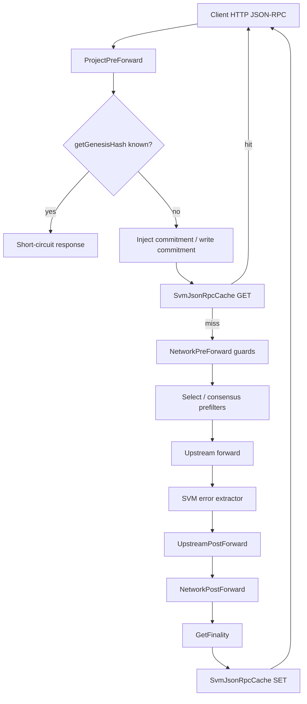

# SVM / Solana — Feature Spec

**Status**: Implemented (Phase 1)
**Last revised**: 2026-07-31

eRPC fronts Solana (and other SVM-compatible) JSON-RPC over HTTP with the same
failsafe, selection, cache, and consensus machinery as EVM — via an
architecture-specific handler under [`architecture/svm/`](../../architecture/svm/).
Phase 1 is **unary HTTP JSON-RPC only**. **This file and the code are the
source of truth.**

---

## 0. Implementation status (what ships today)

Built and wired:

- **`ArchitectureHandler` seam** — `SvmArchitectureHandler` registered for
  `architecture: svm` / `UpstreamTypeSvm` ([handler.go](../../architecture/svm/handler.go)).
- **Network IDs** — `svm:<cluster>` for Solana (chain empty or `"solana"`);
  `svm:<chain>:<cluster>` for forks ([common/architecture_svm.go](../../common/architecture_svm.go)).
- **Commitment injection before cache** — network default stamped in
  `HandleProjectPreForward` so cache GET/SET share one params hash.
- **Finality + `SvmJsonRpcCache`** — never-cache / always-finalized /
  commitment-sensitive classification; shared connectors (memory/Redis/Dynamo).
- **Error normalizer with wire-code preservation** — classify into
  `ErrEndpoint*` for retry/metrics; emit upstream Solana / JSON-RPC codes +
  `error.data` on the wire ([error_normalizer.go](../../architecture/svm/error_normalizer.go)).
- **State poller** — `statePollerInterval` (default **5s**) +
  `statePollerDebounce` (default **400ms**); traffic-gated `getSlot`; sync
  `Poll()` at bootstrap.
- **Genesis fail-closed** — known Solana clusters validated at upstream
  bootstrap; forks via `checkGenesisHash` or table entry.
- **Consensus helpers** — default `ignoreFields` for `context.slot` /
  `context.apiVersion`; finalized slot-lag prefilter (liar-safe reference);
  `minContextSlot` prefilter.
- **Guards** — `getBlock` availability short-circuit (default on);
  `getSignaturesForAddress` slot-window cap; `sendTransaction` non-retryable
  post-forward.

Explicitly out of scope for Phase 1:

- WebSocket / `*Subscribe` / streaming
- Vendor auto-config presets (Helius / Triton / QuickNode, …)
- SVM data-integrity validators (tx root / account cross-checks)

---

## 1. Goals & constraints

- **Zero EVM behavior change.** Mixed EVM+SVM projects share one process;
  architecture dispatch is per-network / per-upstream type.
- **Stable network identity.** Cache partitions and routing keys use
  `svm:<cluster>` or `svm:<chain>:<cluster>` — never collide with `evm:<chainId>`.
- **Commitment-aware finality.** Cache and consensus treat `finalized` as
  durable; `confirmed` / `processed` as unfinalized (TTL-bounded).
- **Solana clients see Solana errors.** Wire JSON-RPC codes and `error.data`
  (preflight simulation logs) are preserved; internal `ErrEndpoint*` taxonomy
  drives retry only.
- **Quota-conscious poller.** Background polls are sparse; live
  `context.slot` keeps tip views fresh under traffic.

---

## 2. Mental model (EVM ↔ SVM)

| Concept | EVM | SVM |
|---|---|---|
| Tip unit | block number | slot (~400ms) |
| Finality knob | block tags / finality depth | `commitment`: finalized / confirmed / processed |
| Chain identity | numeric `chainId` | genesis hash (immutable) + cluster name |
| Network ID | `evm:1` | `svm:mainnet-beta` or `svm:fogo:mainnet` |
| Cache partition | `networkId:blockRef` | `networkId:slotRef` (+ params hash) |
| Write idempotency | nonce / already-known | `sendTransaction` never retried cross-upstream |
| Missing tip data | future block | `-32004` BlockNotAvailable (retryable) |

---

## 3. Configuration

Example: [`erpc.svm.example.yaml`](../../erpc.svm.example.yaml). Types:
[`SvmNetworkConfig` / `SvmUpstreamConfig`](../../common/config.go). Defaults:
[`SetDefaults` on `SvmNetworkConfig`](../../common/defaults.go).

```yaml
projects:
  - id: main
    networkDefaults:
      svm:
        commitment: confirmed          # optional; unset → no injection
        statePollerInterval: 5s
        statePollerDebounce: 400ms
        maxSlotsPerSignaturesQuery: 1000
        maxFinalizedSlotLag: 100
        # enforceBlockAvailability: true  # default when unset
    networks:
      - architecture: svm
        svm:
          cluster: mainnet-beta        # → network id svm:mainnet-beta
          # chain: solana              # optional; empty ≡ solana
    upstreams:
      - id: helius-mainnet
        type: svm
        endpoint: https://mainnet.helius-rpc.com/?api-key=…
        svm:
          cluster: mainnet-beta
          # checkGenesisHash: true     # required for unknown forks
```

HTTP path: `POST /<project>/svm/<cluster>` or
`POST /<project>/svm/<chain>/<cluster>`.

### Network fields (`networks[].svm` / `networkDefaults.svm`)

| Field | Default | Description |
|---|---|---|
| `chain` | `solana` (when empty) | SVM chain id; non-solana → `svm:<chain>:<cluster>` |
| `cluster` | *(required)* | Cluster name (`mainnet-beta`, `devnet`, …) |
| `commitment` | *(none)* | Default injected when request omits commitment. Unset → each upstream’s server default |
| `statePollerInterval` | **5s** | Background ticker for health / shred / (gated) getSlot |
| `statePollerDebounce` | **400ms** | Coalesce + traffic-gate window; keep ≤ interval |
| `maxSlotsPerSignaturesQuery` | **1000** | Cap for `getSignaturesForAddress` when `minContextSlot` is set |
| `maxFinalizedSlotLag` | **100** | Consensus prefilter lag vs liar-safe reference; `0` disables |
| `enforceBlockAvailability` | **true** (when unset) | Short-circuit `getBlock` above highest indexed shred slot |

### Upstream fields (`upstreams[].svm`)

| Field | Default | Description |
|---|---|---|
| `chain` / `cluster` | must match network | Eligibility + genesis key |
| `checkGenesisHash` | `false` | Opt-in bootstrap fetch/compare for **unknown** (chain, cluster). Known Solana clusters always validate |

---

## 4. Architecture seam

`common.RegisterArchitecture(ArchitectureSvm, &SvmArchitectureHandler{})` plugs
SVM into the generic project → network → upstream pipeline.

| Hook | Role |
|---|---|
| `HandleProjectPreForward` | `getGenesisHash` short-circuit; **commitment + write-commitment injection** (pre-cache) |
| `HandleNetworkPreForward` | `getSignaturesForAddress` window; `getBlock` availability |
| `HandleNetworkPostForward` | `getSlot` / `getBlockHeight` tip bookkeeping |
| `HandleUpstreamPostForward` | `sendTransaction` strip retryability; harvest `context.slot` |
| `NewJsonRpcErrorExtractor` | Solana code → `ErrEndpoint*` + wire preserve |

Core packages: `handler.go`, `hooks.go`, `finality.go`, `json_rpc_cache.go`,
`svm_state_poller.go`, `slot_lag.go`, `error_normalizer.go`, `util.go`.

---

## 5. Request lifecycle

Commitment injection **must** run before the cache GET. It mutates params and
invalidates the memoized cache hash; injecting after a cache miss would key
reads on pre-injection params and writes on post-injection params — permanent
misses for defaulted requests.



---

## 6. Finality & cache

[`GetFinality`](../../architecture/svm/finality.go) priority:

1. **`neverCacheMethods`** → `Realtime` (and hard-skipped in cache Get/Set)
2. **`alwaysFinalizedMethods`** → `Finalized` (`getInflationReward`, `getBlockTime`)
3. **Effective commitment** (same `resolveCommitment` as injection) →
   `finalized` → Finalized; `confirmed`/`processed`/unknown → Unfinalized

**Never-cache (effectful or tip-stale):**
`sendTransaction`, `sendRawTransaction`, `simulateTransaction`, `requestAirdrop`,
`getLatestBlockhash`, `getRecentBlockhash`, `getFeeForMessage`,
`getSignatureStatuses`, `getVoteAccounts`, `getLeaderSchedule`, `getEpochInfo`,
`getSlotLeaders`, `getRecentPerformanceSamples`, `getRecentPrioritizationFees`.

**Cache key shape:** partition `<networkId>:<slotRef>` where `slotRef` is
`minContextSlot` when present, else `*`; range key is the params hash. No zstd;
no block-timestamp age guard — TTL bounds unfinalized staleness.

---

## 7. Commitment injection

### Read path

[`commitmentOptionsIndex`](../../architecture/svm/hooks.go) maps method → options
object index (`getBlocks` = trailing append). Injector:

- Honors caller-supplied `commitment`
- Creates the options object only when the slot is the next empty position
- **Skips** when the slot holds a non-object (legacy
  `getBlock(slot, "base64")` encoding string) so shapes are never corrupted
- Skips no-arg methods and methods without a commitment field

### Write path

| Method | Config index | Field |
|---|---|---|
| `sendTransaction` | 1 | `preflightCommitment` |
| `simulateTransaction` | 1 | `commitment` |
| `requestAirdrop` | 2 | `commitment` |

`sendRawTransaction` has no config object — not injected. Write methods are
never cached; injection exists for **cross-upstream consistency**.

---

## 8. State poller

[`SvmStatePoller`](../../architecture/svm/svm_state_poller.go):

| Concern | Behavior |
|---|---|
| Interval | `getHealth`, `getMaxShredInsertSlot`, and (unless gated) two `getSlot` calls (`processed` + `finalized`) |
| Debounce | Skip whole `Poll()` if one finished within the window; under traffic, skip the two `getSlot`s when both views refreshed via `context.slot` within the window |
| Traffic gate bound | At most `maxConsecutiveSlotPollSkips` (4) consecutive gated skips — then force independent `getSlot` |
| Bootstrap | Sync `Poll()` before the upstream is ready |
| Shared state | Monotonic `latestSlot` / `finalizedSlot` counters with rollback tolerance (1024) |
| Health | `maxShredInsertSlot` lag vs tip above `MaxShredInsertSlotLagThreshold` (100) marks degraded |

Live responses feed the poller via `upstreamPostForward_trackContextSlot`
(commitment-routed).

---

## 9. Errors (wire policy)

Classifier: [`architecture/svm/error_normalizer.go`](../../architecture/svm/error_normalizer.go).
Operator catalog: [docs/pages/reference/errors.mdx](../../docs/pages/reference/errors.mdx)
(SVM / Solana JSON-RPC normalization).

**Policy:**

- Upstream Solana / standard JSON-RPC codes → **passthrough** on the wire via
  `JsonRpcErrorNumber(code)`
- Classify into `ErrEndpoint*` for retry, metrics, HTTP class
- Copy `jr.Error.Data` → details `data` → client `error.data`
- HTTP 429 / capacity without a Solana body → synthetic eRPC `-32005`
- `-32000` + simulation/preflight text → wire **`-32002`** (vendors that strip
  the real code)
- `-32000` + rate-limit text → capacity (`-32005`)
- Authoritative missing (`-32009`, “missing in long-term storage”) →
  MissingData, **not** retryable toward network
- Numeric overlap with eRPC synthetics (`-32005`, `-32014`, …): **upstream-derived
  Solana wins on the wire**; eRPC-only synthetics keep eRPC numbers

`sendTransaction` / `sendRawTransaction` failures are stripped of
cross-upstream retryability in post-forward (double-spend guard).

**Preflight / simulation (`-32002`):** Solana SDKs and clients key on
`-32002` (`SendTransactionPreflightFailure`) and parse `error.data`
(simulation `logs`, `err`, compute units). eRPC must **not** remap this to
`-32600` (Invalid Request) or drop `data` — that was a feat-solana wire gap;
preserve is the contract. Vendors that collapse the code to bare `-32000` with
a simulation/preflight message are rewritten to wire `-32002` so clients still
match.

Example shape on the wire (application failure, correctly forwarded — not an
eRPC routing bug):

```json
{
  "code": -32002,
  "message": "Transaction simulation failed: Error processing Instruction 0: custom program error: 0x1",
  "data": {
    "err": { "InstructionError": [0, { "Custom": 1 }] },
    "logs": [
      "Transfer: insufficient lamports …",
      "Program log: Error: insufficient funds"
    ]
  }
}
```

Underfunded accounts, bad instructions, and similar preflight rejects are
**upstream simulation outcomes**. eRPC classifies them client-side /
non-retryable and returns the Solana payload unchanged. Full code→class table:
[docs/pages/reference/errors.mdx](../../docs/pages/reference/errors.mdx).

---

## 10. Consensus & selection helpers

Applied when building the upstream candidate list
([`erpc/networks.go`](../../erpc/networks.go)):

1. **`ignoreFields` defaults** — for RpcResponse-enveloped methods, ignore
   `context.slot` and `context.apiVersion` so consensus compares `value` only
   ([`common/defaults.go`](../../common/defaults.go)).
2. **Finalized slot-lag** — when consensus is active and effective finality is
   Finalized, drop upstreams trailing
   `ReferenceFinalizedSlot` (second-highest clamp vs liar) by more than
   `maxFinalizedSlotLag`. Unknown/zero poller state never excludes; empty
   filter falls back to the full list.
3. **`minContextSlot`** — drop upstreams whose tracked tip (finalized or
   processed per request commitment) is behind the requested slot; same
   defensive empty-list fallback.

---

## 11. Genesis

[`KnownGenesisHash`](../../common/architecture_svm.go) table (Solana today):

| Cluster | Validated at bootstrap |
|---|---|
| `mainnet-beta` / `devnet` / `testnet` | Always — mismatch **or** fetch failure fails the upstream |
| Other / forks | Skip unless `checkGenesisHash: true` (cross-upstream compare) or table entry added |

`getGenesisHash` for known clusters is short-circuited at project pre-forward
(no upstream round-trip), mirroring EVM `eth_chainId`.

---

## 12. Gaps & follow-ups

Known Phase 1 gaps / Phase 2 follow-ups:

1. No live Redis/Dynamo **SVM-keyed** cache round-trip test (connectors shared;
   in-memory unit coverage only for SVM cache).
2. Genesis table is Solana-only; forks need `checkGenesisHash` or a manual entry.
3. `getSignaturesForAddress` window is coarse — only when `minContextSlot` is set
   (`before`/`until` are signatures).
4. Commitment options-index is hand-maintained; unknown methods skip injection.
5. `getBlockTime` treated final-by-construction (low-risk simplification).
6. No commitment-downgrade detection on responses.
7. No WS / subscriptions.
8. No SVM integrity validators beyond finality/commitment.
9. No vendor presets.
10. Non-Solana SVM forks supported by construction; coverage beyond Fogo is thin.

---

## 13. Source map

| Area | Path |
|---|---|
| Handler / hooks | [`architecture/svm/handler.go`](../../architecture/svm/handler.go), [`hooks.go`](../../architecture/svm/hooks.go) |
| Finality | [`architecture/svm/finality.go`](../../architecture/svm/finality.go) |
| Cache | [`architecture/svm/json_rpc_cache.go`](../../architecture/svm/json_rpc_cache.go) |
| Poller | [`architecture/svm/svm_state_poller.go`](../../architecture/svm/svm_state_poller.go) |
| Slot lag / minContextSlot | [`architecture/svm/slot_lag.go`](../../architecture/svm/slot_lag.go) |
| Errors | [`architecture/svm/error_normalizer.go`](../../architecture/svm/error_normalizer.go) |
| Network ID / genesis | [`common/architecture_svm.go`](../../common/architecture_svm.go) |
| Config / defaults | [`common/config.go`](../../common/config.go), [`common/defaults.go`](../../common/defaults.go) |
| Consensus wiring | [`erpc/networks.go`](../../erpc/networks.go), [`consensus/`](../../consensus/) |
| Example config | [`erpc.svm.example.yaml`](../../erpc.svm.example.yaml) |
| E2E | [`erpc/svm_e2e_test.go`](../../erpc/svm_e2e_test.go) |
| Error docs | [`docs/pages/reference/errors.mdx`](../../docs/pages/reference/errors.mdx) |
